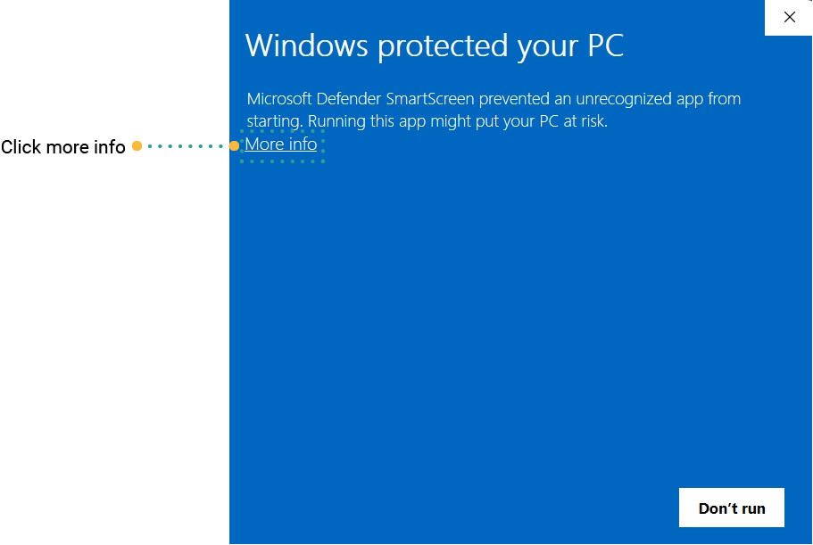

# Getting Started
## Rubix CE (Rubix Computer Edition)

Rubix Platform CE servers is a Nube iO desktop software designed for offline programming and product management. 
Engineered to be swift, efficient, and portable, it empowers users and technicians
to remotely configure and implement changes without the need for a continuous internet connection.

To get started with Rubix CE, the following are required:

:::info
### Prerequisites

To get started with Rubix CE, ensure you have the following:

- **Compatible PC**: Running Windows 10, Windows 11, Linux, or macOS.
- **Internet Connection**: Required for initial setup and downloads.
- **Rubix CE Software**: Download and install from the **[downloads page](download.md#download)**.
- **Nube iO Cloud Account**: Necessary for accessing cloud features. **[Nube iO Cloud Account](docker.md#nube-io-cloud-account)**.
- **Optional Hardware**: Nube iO Rubix Compute device. **[More info on Rubix Compute](../../hardware/controllers/supervisors/rubix-compute/user-manual.md)**.

*Note: This documentation provides examples and instructions primarily for Windows users.*
:::

### Installation

Rubix CE doesn't require traditional installation. To set it up:

1. **Extract the Downloaded File**: Right-click the downloaded `.zip` file and select "Extract All."
2. **Run Rubix CE**: Navigate to the extracted folder, right-click on the `RubixCE.exe` file, and choose "Run as administrator."

*Note: If Windows Defender blocks the application, click "More Info" and then select "Run Anyway."*





### Initial Setup ###

Upon launching Rubix CE for the first time:

1. **Enter Token**: Contact Nube iO support at [support@nube-io.com](mailto:support@nube-io.com) to request your unique token. This token is essential for downloading apps and services over the internet. Once received, paste it into the provided field.

   

2. **Choose an Option**:
   - **Create Supervisor**: Set up a new supervisor instance.
   - **Enter Application**: Proceed without creating a supervisor.

   *Note: If you choose not to create a supervisor during this step, you can add one later.*

   


Should you choose not to create a [Create supervisor](supervisor.md#supervisor) during the installation process, you can always add one later.


A newly launched software will appear like this.

 ### Navigating the Interface


-   **Refresh Button**: Updates data in the current table view.
-  **Add Button**: Adds new objects to the application (e.g., users, devices).
-  **Delete Button**: Removes selected objects. Ensure items are selected in the table before attempting deletion.
-  **Import Button**: Imports supervisors using an Excel file.
-  **Export Button**: Exports supervisors to an Excel file.

### Key Components

- **Supervisor**: A central entity managing multiple devices, either a physical Rubix Compute device or a connection to the Nube iO cloud service.
- **Location**: Groups of Rubix Computes, typically representing physical or logical areas.
- **Group**: Clusters of Rubix Computes for simplified management (e.g., "Level-1" or "Metering").
- **Device**: A physical entity, such as a Rubix Compute.


## Example setup

```
-- supervisor (Acme Corp) // Customer
--- location (New York) // STATE
---- group  (NYC) // CITY
----- Empire State Building Metering // Rubix Compute
```

```
-- supervisor (Acme Corp) 
--- location (Empire State Building)
---group  (level -1) 
----RC1 // Rubix Compute
---group  (level -2)
----RC2 // Rubix Compute
```

```
-- supervisor (Empire State Building) // Customer as a building
--- location (Level 1)
---group  (AUHs)
----RC1 
---group  (Metering)
----RC2
```

### Sidebar Navigation

The sidebar allows easy navigation between supervisors, devices, protocols, and sensors.


### Activating Supervisors

To view and manage supervisors:

1. **Enable Supervisor**: In the supervisors table, right-click the desired supervisor and select "Enable Supervisor."

  

For more detailed information and advanced configurations, refer to the **[Supervisor](supervisor.md)** page.

---

Let me know if you need any further assistance or modifications!


