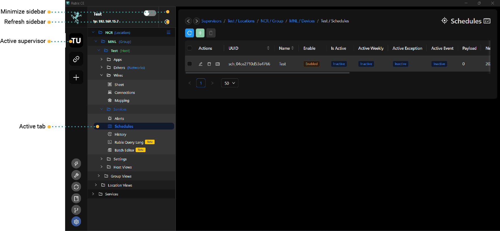
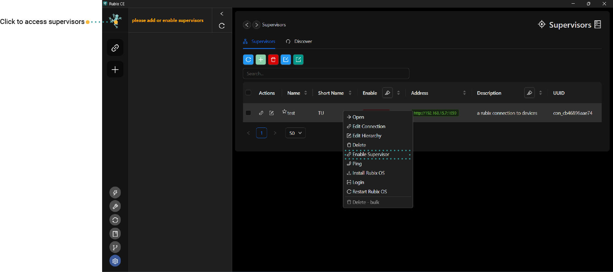

# Getting Started
## Rubix CE (Rubix Computer Edition)

Rubix Platform CE servers is a Nube iO desktop software designed for offline programming and product management. 
Engineered to be swift, efficient, and portable, it empowers users and technicians
to remotely configure and implement changes without the need for a continuous internet connection.

To get started with Rubix CE, the following are required:

:::info
* PC equipped with either Windows 10 or Windows 11.
* Internet connection.
* Download and install the Rubix CE software from this link: **[downloads page](download.md#download)**
* **[Nube iO Cloud Account](docker.md#nube-io-cloud-account)**
* And/Or Nube iO **[Rubix Compute](../../hardware/controllers/supervisors/rubix-compute/overview.md)**
:::

  

### Install

No installation is necessary. Simply right-click to run Rubix CE. <br/>
If you're running the software on a Windows machine, Windows Defender might prevent its execution. In such cases, simply click on `More Info` and then proceed by selecting `Run Anyway.`


### Running Rubix CE

## Add token


:::caution token
Contact Nube iO support at support@nube-io.com to request for a unique token. <br/>
:::


The Token is essential for downloading Apps and Services over the internet. Once received, simply copy and paste the token into the provided field.


You will then have an option to either `Create supervisor`or `Enter Application`

Should you choose not to create a [Create supervisor](supervisor.md#supervisor) during the installation process, you can always add one later.


A newly launched software will appear like this.


## Buttons

  Refresh button serves the purpose of updating data in the table view.

  The Add button is used for adding object to the application (such as
adding a user).

  Delete button is used for removing an object. To execute a delete operation,
please ensure that one or more items are selected in the table beforehand.

  Import button is used for importing supervisor using an excel file.

  Export button is used for exporting supervisor from the supervisors tab to an excel file.


## Supervisors

Supervisor can either be a physical Rubix Compute device or a connection to a Nube iO cloud service.

## Location

Location is comprised of groups of Rubix Computes.

## Group

Serves as a method to cluster Rubix Computes for simplified device identification and management. For Example: `level-1` or `metering`.

## Devices
Directs users to access the Rubix Computes

## Device
A physical Rubix Compute.

## Example setup

```
-- supervisor (Acme Corp) // Customer
--- location (New York) // STATE
---- group  (NYC) // CITY
----- Empire State Building Metering // Rubix Compute
```

```
-- supervisor (Acme Corp) 
--- location (Empire State Building)
---group  (level -1) 
----RC1 // Rubix Compute
---group  (level -2)
----RC2 // Rubix Compute
```

```
-- supervisor (Empire State Building) // Customer as a building
--- location (Level 1)
---group  (AUHs)
----RC1 
---group  (Metering)
----RC2
```


## Sidebar

The sidebar provides a simple means of navigating between supervisors, devices, protocols, and sensors.



## Active Supervisors

:::caution
At this point, you should have already added a supervisor. Please refer to **[supervisor](supervisor.md)** if you haven't done so already. 
:::

To view supervisors on the sidebar, you must enable them from the supervisors table.

Right-click the supervisor your wish to enable then click `Enable Supervisor`




