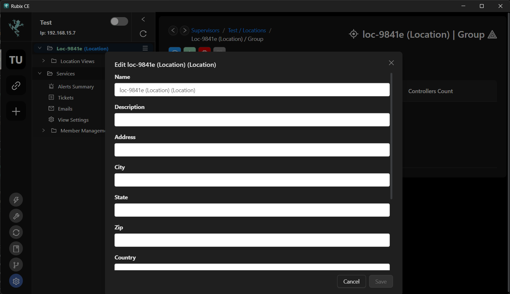
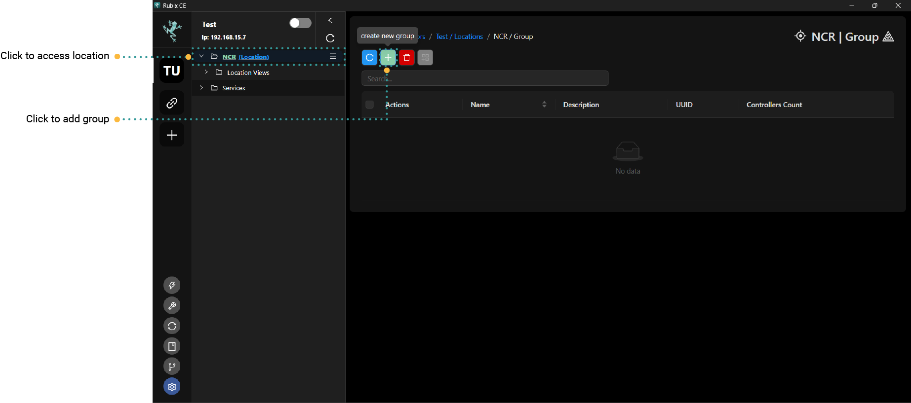
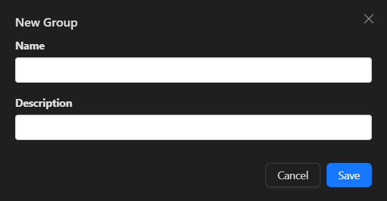
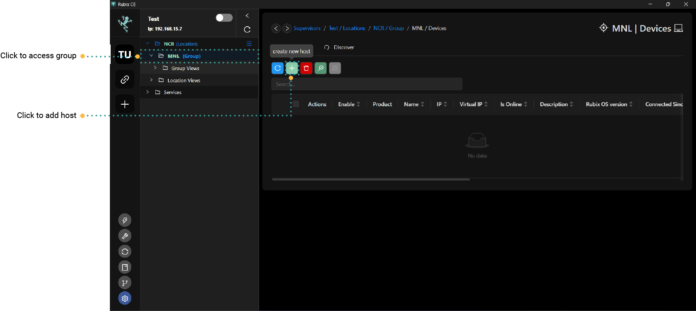
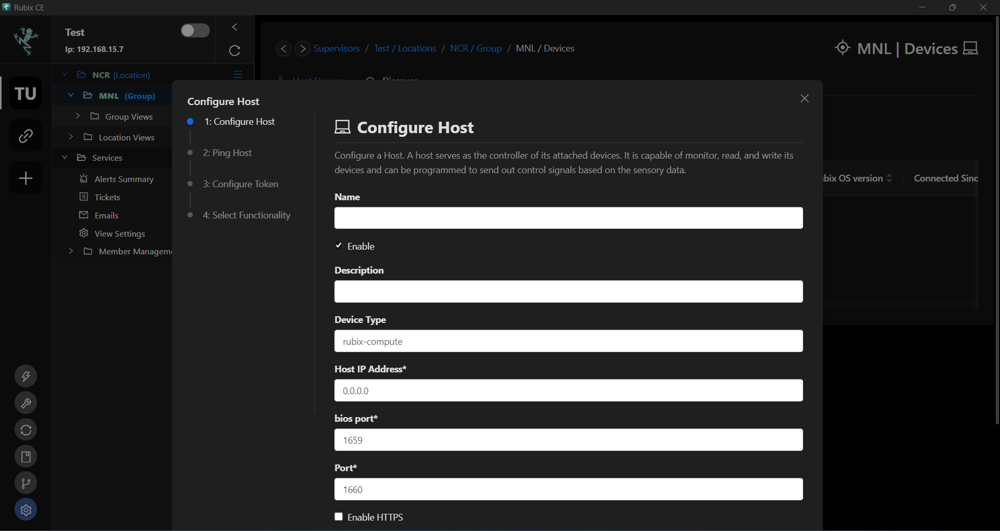
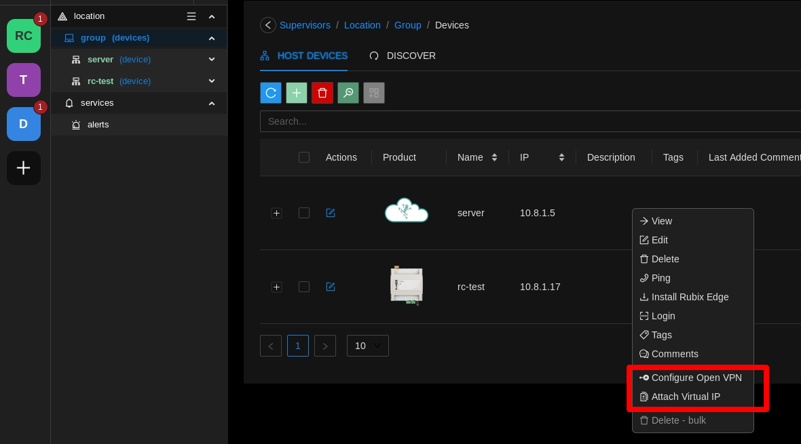

## Hosts/Rubix Computes

A Rubix Compute (host) is to be added under a Supervisor.

:::caution
At this point, you should have already added a `supervisor`. If not, please refer to the instructions for adding a **[supervisor](supervisor.md)**.
:::

:::info
A Rubix Compute can also serves as a supervisor controller.  
However, you can only add a Rubix Compute after you have already added a **supervisor/location and group**
:::

## Add Location
Click on the `Create new Location` -or- click   inside the **Supervisor tab**

:::info
When you add a location, if you click `Save` without entering any information, Rubix will assign a `default name` to the location. You can modify its settings by right-clicking on the location and selecting `Edit`.
:::

## Add Group
Click   inside the **Location tab**. 

Click `save` once you have fill up the name and description (tentative).

## Add Host
Click   inside the **Group tab**. 

### Add a Local Device

This is only applicable when you have only one `Rubix Compute` and wish to connect to it directly, bypassing the need for the `Nube iO cloud`.

:::info pre start checks
- A **[rubix-compute](../../hardware/controllers/supervisors/rubix-compute/overview.md)** with network access to the
  device
- The default IP on `ETH-1` is `192.168.15.10` the 2nd port `ETH-2` is set to `DHCP`
- Set you PC on the same network or set a fixed IP on your PC **[networking](../../hardware/controllers/supervisors/rubix-compute/networks.md)**
:::

```mermaid
flowchart TD
    A[[Rubix-CE]] --> B[Rubix-Compute-1]
```

### Add Device to a Cloud Server
Adding a local device to the Nube iO Servers will only be required when you only have one Rubix Compute, and you want to connect to it `with` using the `Nube iO Cloud`

:::info pre start checks
- Before proceeding, ensure you have added the device following the same steps as outlined above.
- A **[rubix-compute](../../hardware/controllers/supervisors/rubix-compute/overview.md)** with network access to the device and a public IP address assigned.
- Connect your PC to your local network. See **[networking](../../hardware/controllers/supervisors/rubix-compute/networks.md)** to see how.
:::

:::caution
To establish a VPN connection between the cloud and the Rubix Compute, you'll require access to either your office router or a 4G router to assign a temporary public IP address to the Rubix Compute.
:::

```mermaid
flowchart TD
    A[[Rubix-CE]] --> B[Nube-IO Cloud]
    B[Nube-IO Cloud]--> C[Rubix-Compute-1]
```

<b>OpenVPN Service</b>

Open the **device/apps**

<b> Connect to the VPN </b>

Right Click on the device you want to add the `vpn` to

