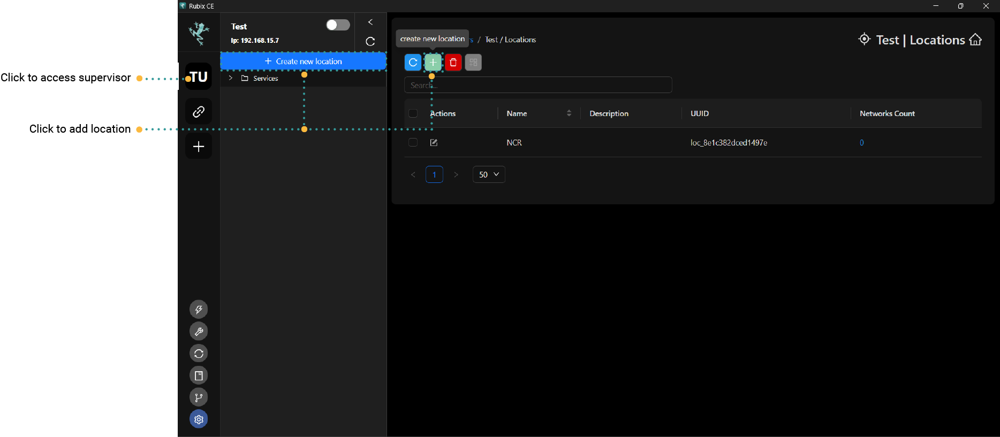
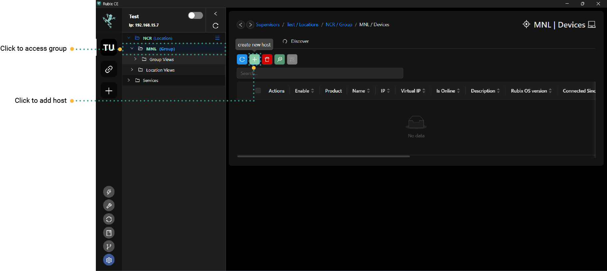

# Hosts

## Overview
**Rubix Compute (Host)** refers to a computing device or platform developed by **Nube iO**. It's designed for various applications in building automation and IoT (Internet of Things) contexts. Rubix Compute can serve as a central hub for collecting, processing, and analysing data from sensors, devices, and systems within a building or industrial environment. It typically runs specialized software or applications developed by Nube iO or third-party developers to enable functionalities such as data monitoring, control, and optimization. Rubix Compute plays a crucial role in creating smart and interconnected building systems by facilitating data-driven decision-making and automation.

A Host is to be added under a `Supervisor`.

:::caution
At this point, you should have already added a `supervisor`. If not, please refer to the instructions for adding a **[supervisor](supervisor.md)**.
:::

:::info
A Rubix Compute can also serves as a supervisor controller.  
However, you can only add a host after you have already added a **supervisor/location and group**
:::

## Add Location
Click on the `Create new Location` -or- click   inside the **Supervisor tab**

:::info
When you add a location, if you click `Save` without entering any information, Rubix CE will assign a `default name` to the location. You can modify its settings by right-clicking on the location and selecting `Edit`.
:::

## Add Group
Click   inside the **Location tab**. 

Click `save` once you have fill up the name and description (tentative).

## Add Host
Click   inside the **Group tab**. 

### Add a Local Device

This is only applicable when you have `Rubix Compute` and wish to connect to it directly, bypassing the need for the `Nube iO cloud`. 
Initially, to connect to multiple hosts on a local network, you'll designate one host as the supervisor. When this device is added as a host, its IP will be 0.0.0.0, reflecting that the supervisor's IP is identical to that of the host itself. This holds true even if there is only one host on your network, as that host will also have the IP address 0.0.0.0.

:::info pre start checks
- A **[Rubix Compute](../../hardware/controllers/supervisors/rubix-compute/overview.md)** with network access to the
  device
- The default IP on `ETH-1` is `192.168.15.10` the 2nd port `ETH-2` is set to `DHCP`
- Set your PC on the same network or set a fixed IP on your PC **[networking](../../hardware/controllers/supervisors/rubix-compute/networks.md)**
:::

### Add Device to a Cloud Server
Adding a local device to the Nube iO Servers will only be required when you only have one Rubix Compute, and you want to connect to it `with` using the `Nube iO Cloud`

:::info pre start checks
- Before proceeding, ensure you have added the device following the same steps as outlined above.
- A **[Rubix Compute](../../hardware/controllers/supervisors/rubix-compute/overview.md)** with network access to the device and a public IP address assigned.
- Connect your PC to your local network. See **[networking](../../hardware/controllers/supervisors/rubix-compute/networks.md)** to see how.
:::

:::caution
To establish a VPN connection between the cloud and the Rubix Compute, you'll require access to either your office router or a 4G router to assign a temporary public IP address to the Rubix Compute.
:::

## OpenVPN Service

OpenVPN is an open-source software application that implements virtual private network (VPN) techniques for creating secure point-to-point or site-to-site connections in routed or bridged configurations and remote access facilities. Below are the steps on how to set up VPN on your device:

1. Navigate to the devices section.
2. Right-click on the device where you want to add the VPN and select `Configure Open VPN`.
3. Wait for the prompt confirming that the VPN has been configured.
4. Click the `refresh` button and verify if the VPN is displayed on the `Virtual IP tab`.
5. Right-click on the same device again and choose `Attach Virtual IP`.
6. Wait for the prompt confirming that the virtual IP has been configured successfully.

