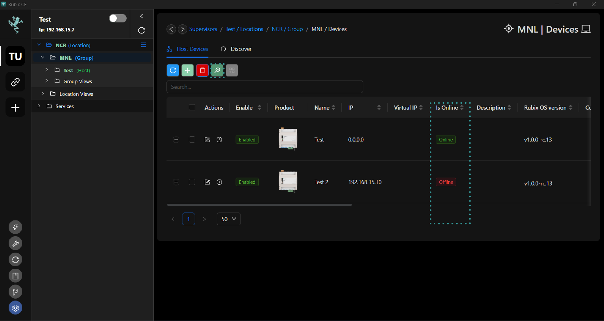
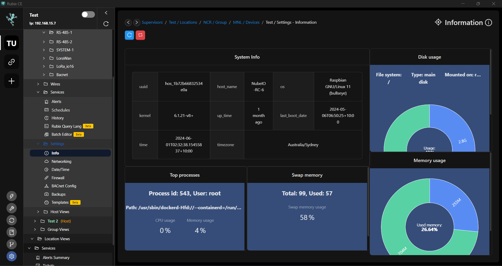
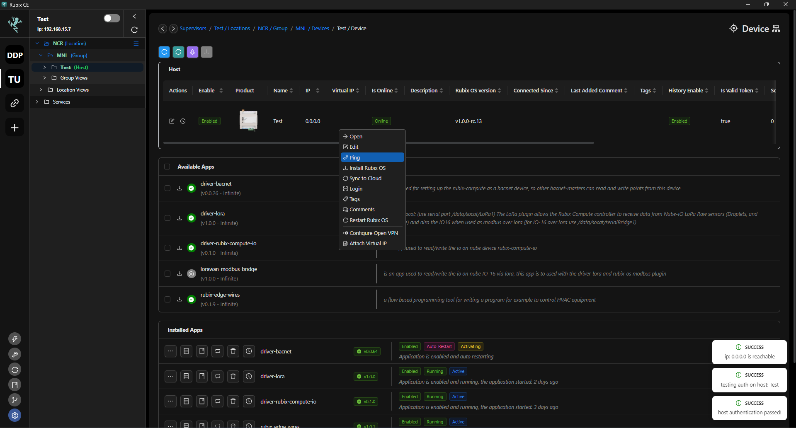
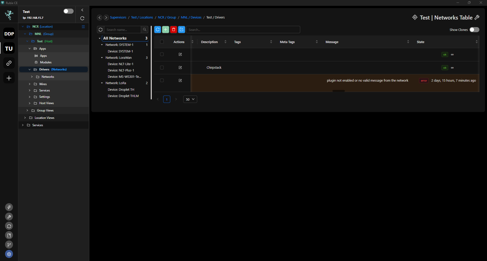
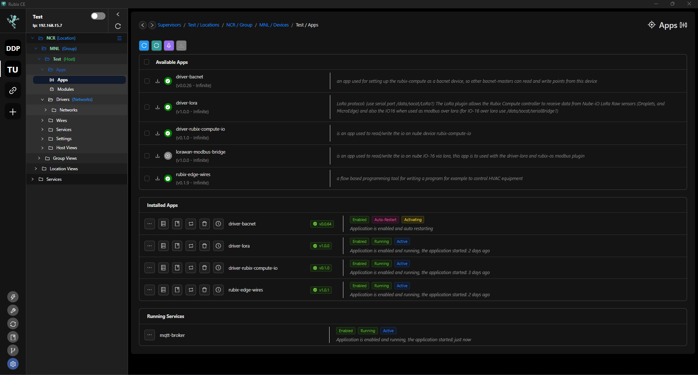

# Troubleshooting

## Device Offline

Rubix CE can detect if a device is offline. To check the availability of the device, navigate to the Host View.
  
Click  to update the current online/offline status of the devices.

### Device Offline for Remote Connections
*** Network Downtime: *** Network signal is poor or nonexistent, the on-site engineer is advised to take the following steps to ensure connectivity:
* Check on the router's reception indicator.
* Restart the problematic device or check if the router is working correctly.
* Inspect the SIM integrity.

### Device Offline for Local Network without Internet
* Ensure the device is powered on.
* Verify the network configuration is correct.
* Check for any damage to the Ethernet cable.
* Verify if other devices on the same network are experiencing similar issues.
* Restart the router to refresh the network connection.

## System Performace
If **Rubix CE** experiences performance issues, you can diagnose potential causes by accessing system information in the `Info` section under `settings`. This information includes CPU usage, memory usage, swap memory usage, and disk usage. analysing these metrics can help pinpoint the source of performance degradation and guide troubleshooting efforts to address the underlying issues.

## Rubix Host/Supervisor Level Troubleshooting
* Initiate a ping to the Host/Supervisor by right-clicking on it as shown in the image below:

* After confirming connectivity with the host/supervisor, authenticate by right-clicking and selecting `Login`.
* Once logged in, verify the presence of Rubix-OS. If it is not installed, you can install it by right-clicking on Rubix-OS and selecting `Install`.
* Additionally, for troubleshooting purposes, you can restart Rubix-OS from the right-click menu, which can resolve issues on problematic systems. Restarting Rubix-OS can help resolve various issues by resetting its state and clearing temporary glitches or errors that may have occurred during operation. 

## Network/Device/Points Level Troubleshooting
* If a network/device/points is highlighted in orange, scroll right to identify potential issues. See **Error Lists** below for more information.
* In this example, the error message indicates either the plugin is not enabled or there's no valid message from the network.

* You will need to confirm that the module is installed correctly, the app is enabled, and functioning properly. For instructions on navigating through apps and modules, please refer to   **[modules](Modules.md)** and  **[apps](apps.md)** respectively.

* In the image above, observe that BacNet is currently activating. This can be the reason why the plugin is is highlighted in orange. 
* Restart the driver to refresh the connection. See if problem still persists.
* Sometimes, even if the plugin is enabled, errors persist due to incorrect parameters. Ensure that the parameters configured in your driver match those of the devices you're attempting to connect to. You can edit the these parameters at the drivers tab. See **[drivers](../drivers/overview.md)** and select the driver you wanted to explore.

### Error Lists
|Module                 |Level      | Message |Issue   |
|-----------------------|-----------|---------|--------|
|module-core-bacnet|Devices|**`No response from target device`**|when driver-bacnet app doesn't get a response from the target device (timeout)|
|module-core-bacnet|Points|**`unknown-object`**| if the mapped point doesn't exist in the bacnet-server|
|module-core-bacnet|Points|**`timed out`**|no value received from driver-bacnet app polling|
|module-core-modbus (**`Serial`**)|Network|**`could not open <serial_port>: no such file or directory`**|when there is no such serial port available|
|module-core-modbus (**`Serial`**)|Devices|**`serial: timeout`**|when the poll point gets timeout (normally it happens if there's a connection issue)|
|module-core-modbus (**`Serial`**)|Devices|**`could not open <serial_port>: no such file or directory`**|when there is no such serial port available|
|module-core-modbus (**`Serial`**)|Points|**`serial: timeout`**| when the poll point gets timeout (normally it happens if there's a physical connection issue)
|module-core-modbus (**`Serial`**)|Points|**`could not open <serial_port>: no such file or directory`**|when there is no such serial port available|
|module-core-modbus (**`TCP`**)|Devices|**`dial tcp <ip>:<port>: connect: connection refused`**|connection refuse, check IP & port|
|module-core-modbus (**`TCP`**)|Devices|**`dial tcp <ip>:<port>: i/o timeout`**|when the poll gets timeout (normally it happens if there's a physical connection issue)|
|module-core-modbus (**`TCP`**)|Points|**`dial tcp <ip>:<port>: i/o timeout`**|when the poll point gets timeout (normally it happens if there's a physical connection issue)|

