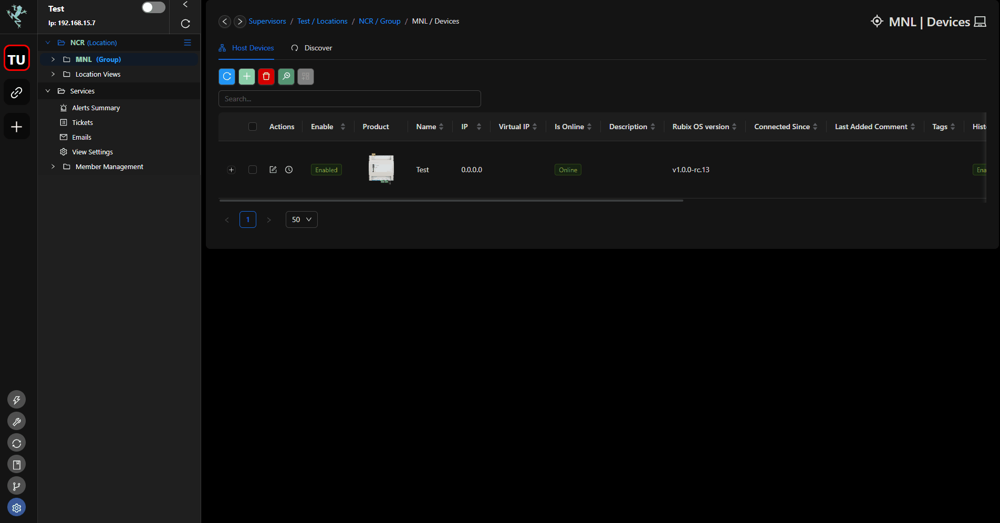
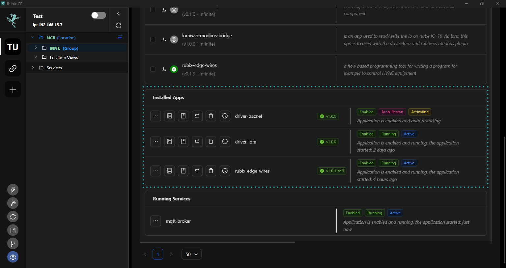
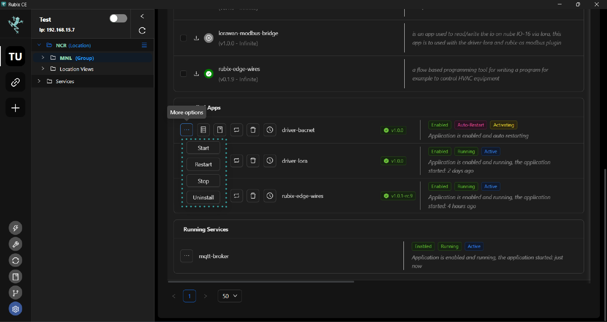

# Apps

:::danger Internet Connection
To download apps over the internet, you need to ensure you have the current Github token added in CE. This token is provided by the Nube iO Support team to each individual upon request and remains valid for up to one year. For assistance, please contact support@nube-io.com.
:::

:::danger user home directory
When installing apps, zip files will be added to your user home directory at **/home/my-user/rubix/store/apps**.
:::

## Managing apps

Rubix Compute is akin to installing or managing apps on a PC, smartphone, or tablet.
Examples of Nube iO Apps includes:

* BACnet Server
* LoRaWAN® Protocol
* Rubix Wires

## App Installation

1. Make sure to add your Github token. 
2. Click on the  icon to see the dropdown options of the Apps Manager.
3. The Apps Manager provides lists of applications that you can install, uninstall, and edit.

### Single App Installation
Apps can be installed by using the `Download` icon (down arrow) on the row of the App/Service required.

1. Click the `Download` arrow icon on the row of the App/Service that is required to be installed.
2. Install app window will pop up on the screen.
3. Choose the desired App version from the `Select Release Version` drop-down menu, typically opting for the latest version available, and proceed by clicking the `Install button`  in blue button.
4. Wait for installation to be completed and for `Installation Complete` to be displayed. Click `Done`.

### Multiple App Installation

1. Click the checkbox of all apps you wished to install.
2. Click the `bulk installation icon` to initialized installation.
3. Choose the desired App version from the `Select Release Version` drop-down menu, typically opting for the latest version available, and proceed by clicking the `Install button`  in blue button.
4. Wait for installation to be completed and for `Installation Complete` to be displayed. 

## Updating Existing Apps/Services

Updating an existing App/Service follows a process similar to installing one. The primary difference lies in the displayed `Version`, which indicates the currently installed version instead of the available versions for installation.

1. Click the `Download` arrow icon on the row of the App/Service that is required to be installed.
2. Install app window will pop up on the screen.
3. Choose the desired App version from the `Select Release Version` drop-down menu, typically opting for the latest version available, and proceed by clicking the `Install button`  in blue button.
4. Wait for installation to be completed and  for `Installation Complete` to be displayed. Click `Done`.

## Apps/Service Status

Within the Apps/Services tab, you'll find tiles representing each installed App. Each tile features a colored status label indicating the current status of the respective service.

 
* **Running** (Green) - means that the App/Service is currently running.
* **Inactive** (Yellow) - means the App/Service is not running (may not be Enabled).
* **Stopped** (Red) - means the app/service is not running (may not be Enabled).
* **Activating** (Yellow) - means the App/Service is starting, but is not yet running.

## Delete Database
By clicking `Delete Database` and confirming it with a subsequent click on `Confirm`, you will initiate the irreversible process of permanently removing the specific app's database.

## Open Log

By clicking on "Logs," a pop-up window will appear displaying a log table. This table includes timestamps, levels, and messages for the logs. You can filter these logs using a search function

## More Options

Within the Apps/Services tab, installed apps can be managed by accessing more options. Simply click on the desired app, and a menu will appear with options to start, stop, restart, or uninstall it. After selecting the desired action, refresh the page to observe the updated status of the app or service.

 

### Start

Initiating the `Start` function for an enabled app will activate and set the app into motion, enabling its operation.

### Restart

Clicking `Restart` will trigger the app to undergo a restart process. You can monitor the `Active` label, which indicates the duration for which the service has been running. Following a restart, the active time displayed should reset to a very low value.

Additionally, there's an option to schedule an auto restart, enabling the app to automatically restart at predefined intervals.

### Stop

Pressing `Stop` will halt the operation of the app, effectively ceasing its execution and preventing it from continuing to run.

### Uninstall

To uninstall or delete an app/service, you have a couple of options:

1. Click on "Uninstall" in the more options menu.
2. Click on the trash bin icon.

After clicking either option, a confirmation window will appear asking you to confirm the deletion. Click "YES" to proceed with deleting the app/service.

Wait for the deletion process to complete. Once finished, the page will automatically refresh. Ensure to verify that the app/service has been successfully removed from the list.
