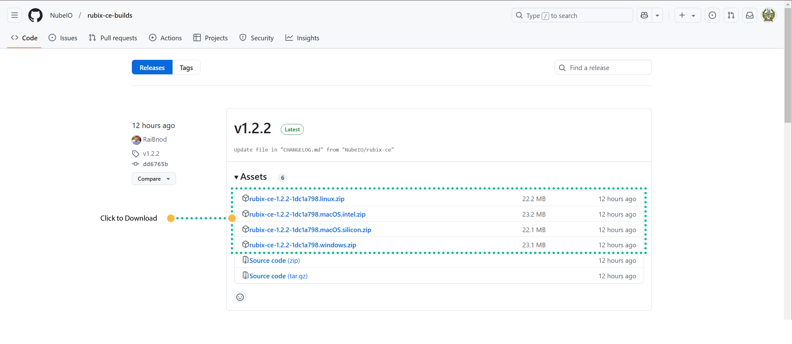

# Download

:::info download links
**[link to all downloads](https://github.com/NubeIO/rubix-ce-builds/releases)**
:::

# OS support
Rubix CE is compatible with Windows, Mac, and Linux operating systems.

## Download 

To download for Windows, look for the version build labelled as `Windows`  
For example, latest Windows version is labelled as `rubix-ce-1.0.0-e6cdfba2.windows.zip`

:::info get the Latest version
Nube iO GitHub `releases` page will indicate the latest version of Rubix CE with a green **Latest** icon.
:::

# Migrations 

# From Flow Framework to Rubix OS

Nube iO is fully equipped to perform updates or migrations on any Rubix Compute system upon request. Should such services be required, please do not hesitate to contact support@nube-io.com for further assistance.   
The process typically spans approximately 5 minutes, during which no data will be lost. 
It's worth noting that upgrades may occasionally become necessary following significant firmware releases.
 

:::danger backward compatibility
- Rubix CE does not support backward compatibility with Nube iO Flow Framework or the Rubix Platform.  
- Rubix Wires does not offer backward compatibility with Rubix Edge Wires.  
- `rubix-os` is incompatible with Nube iO `edge-28` 
:::

