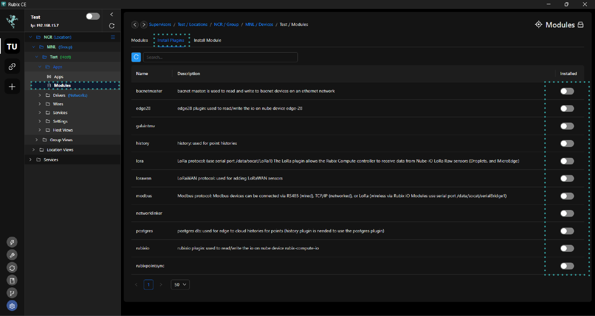
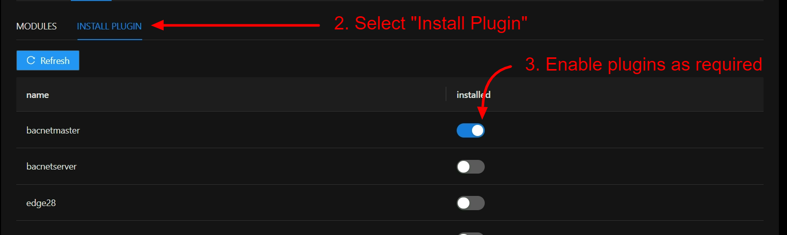

# Flow Framework

# Overview

The rubix flow network allows for reading and writing to `things` that are connection to the rubix-gateway (an IoT Gateway) that are installed in the building.
The API that is in the gateway can be connected to the cloud. When connected to the cloud, this allows for an external API to read and write to the connected sensors and devices

The following features are supported
* Reading point values (sensors, logical)
* Writing to points, priority array supported
* Writing time schedules
* Mass control operations, for example mass updates of time schedules (Command Groups)
* Updates to the gateway app's

# Rubix-Compute
The Rubix-Compute is the NubeIO gateway. It is a small wireless gateway capable of monitoring and controlling various applications. For example, it can be used in building to control and monitor the heating, cooling and ventilation systems.

# Modules (Plugins)
Modules (or Plugins) are software applications used to enable various functions on the Rubix Compute. Once controllers have been installed on Rubix-Platform-CE (see here add link), modules will have to be installed to enable supported functions such as Lora, Bacnet or Modbus communications. 

## Install A Plugin
After adding the controller, click on the view network button in the "Actions" column

