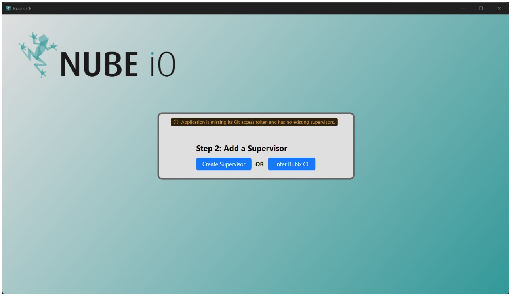

# Getting Started

## Rubix Computer Edition (CE - Overview)

Rubix Platform CE is Nube iO's new desktop software designed for offline programming and product management.
Built to be fast, lightweight and portable, it allows users and technicians to configure and modify remotely without
requiring a constant internet connection.

You need the following to get started

:::info
* A Windows PC 10 or 11 
* An internet connection
* **[downloads page](download.md#download)** if not done so please download and install the rubix-ce software
* A **[nube-io cloud account](docker.md#nube-io-cloud-account)**
* And or a nube-io **[rubix-compute](../../hardware/controllers/supervisors/rubix-compute/overview.md)**
:::

  

# Install

No install is required just right click and run the program

# Running Rubix-CE

## Add token


:::caution token
you need to contact nube support to get a token <br/>
support@nube-io.com
:::


paste in the token, the token is needed to download apps and services over the internet


You will then have the option to either `Enter Application` or `Create supervisor`

if you don't [Create supervisor](supervisor.md#supervisor) don't worry you can always add one later



## Buttons

  Add button is used for adding object to the application (for example
adding a user)

  Refresh button refreshing data in a table view

  Delete button is used for deleting an object for delete to work
please select one or more items in the table


## Supervisors

A supervisors can be either a physical Nube-IO rubix-compute or a connection to Nube-IO cloud

## Location

A location is a collection of groups of rubix-computes

## Group

A way to group rubix-computes, eg: `level-1` or `metering`

## Devices
A link to click on the rubix-computes

## Device
A physical Nube-IO rubix-compute

## Example setup

```
-- supervisor (Acme Corp) // Customer
--- location (New York) // STATE
---- group  (NYC) // CITY
----- Empire State Building Metering // Rubix-Compute
```

```
-- supervisor (Acme Corp) 
--- location (Empire State Building)
---group  (level -1) 
----RC1 // Rubix-Compute
---group  (level -2)
----RC2 // Rubix-Compute
```

```
-- supervisor (Empire State Building) // Customer as a building
--- location (Level 1)
---group  (AUHs)
----RC1 
---group  (Metering)
----RC2
```


## Sidebar

The sidebar is they way to navigate between supervisors, devices, protocols and sensors


### Active Supervisors

:::info
You must have already added a supervisor, See adding a **[supervisor](supervisor.md)**
:::

If you wish to view a supervisors on the sidebar you need to enable the supervisors from the supervisors table.

Right-click and `Enable Supervisor`


