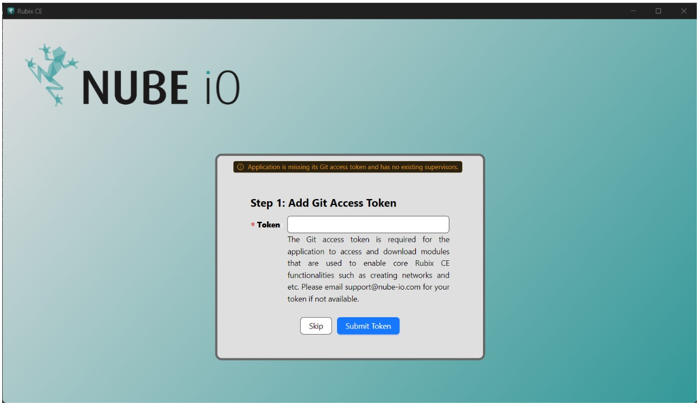
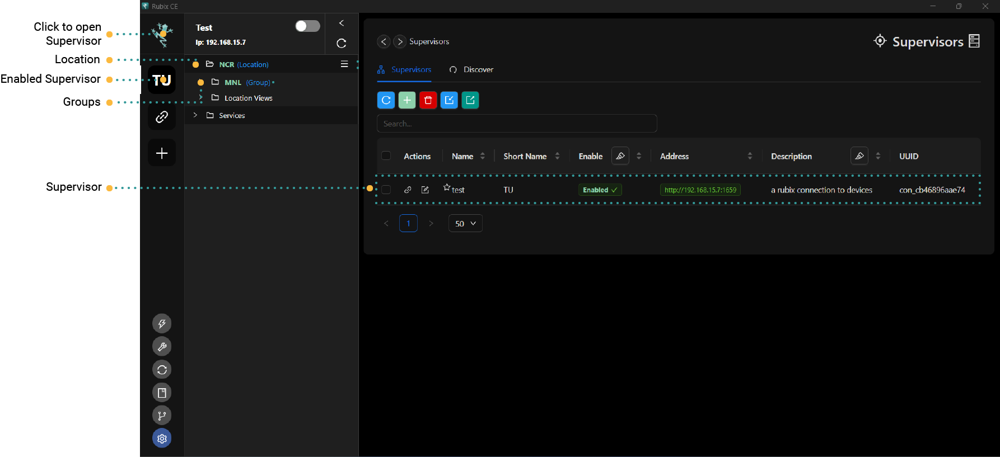

# Getting Started

## Rubix CE (Rubix Computer Edition)

Rubix Platform CE is the Nube iO desktop software required for offline programming and product management.
Built to be fast, lightweight and portable, it allows users and technicians to configure and make changes remotely without
requiring a constant internet connection.

You will need the following to get started with Rubix CE:

:::info
* A Windows PC 10 or 11.
* An internet connection.
* **[downloads page](download.md#download)** please download and install the Rubix CE software.
* A **[nube-io cloud account](docker.md#nube-io-cloud-account)**
* And or a Nube iO **[rubix-compute](../../hardware/controllers/supervisors/rubix-compute/overview.md)**
:::

  

# Install

No install is required. Simply right click to run Rubix CE.

# Running Rubix-CE

## Add token


:::caution token
Please contact Nube iO support to request a unique token via support@nube-io.com <br/>
:::


Copy and Paste in the token, the token is required to download Apps and Services over the internet.



You will then have an option to either `Enter Application` or `Create supervisor`

If you do not [Create supervisor](supervisor.md#supervisor) don't worry you can always add one later.


## Buttons

  The Add button is used for adding object to the application (for example
adding a user).

  Refresh button is used for refreshing data in a table view.

  Delete button is used for deleting an object.  For delete to work
please select one or more items in the table before deleting.


## Supervisors

A supervisors can be either a physical Rubix Compute or a connection to a Nube iO cloud Service.

## Location

A location is a collection of groups of Rubix Computes.

## Group

A way to group Rubix Computes for easier deivce identifcation or management. For Example: `level-1` or `metering`.

## Devices
A link to click on the Rubix Computes.

## Device
A physical Rubix Compute.

## Example setup

```
-- supervisor (Acme Corp) // Customer
--- location (New York) // STATE
---- group  (NYC) // CITY
----- Empire State Building Metering // Rubix-Compute
```

```
-- supervisor (Acme Corp) 
--- location (Empire State Building)
---group  (level -1) 
----RC1 // Rubix-Compute
---group  (level -2)
----RC2 // Rubix-Compute
```

```
-- supervisor (Empire State Building) // Customer as a building
--- location (Level 1)
---group  (AUHs)
----RC1 
---group  (Metering)
----RC2
```




## Sidebar

The sidebar is they way to easily navigate between supervisors, devices, protocols and sensors.


### Active Supervisors

:::caution
You must have already added a supervisor. See adding a **[supervisor](supervisor.md)**
:::

If you wish to view a supervisors on the sidebar you need to enable the supervisors from the supervisors table.

Right-click and `Enable Supervisor`


