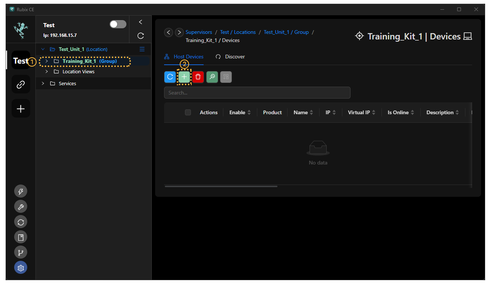
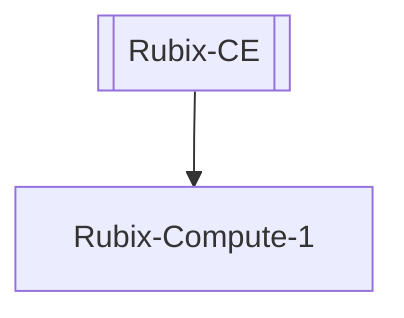
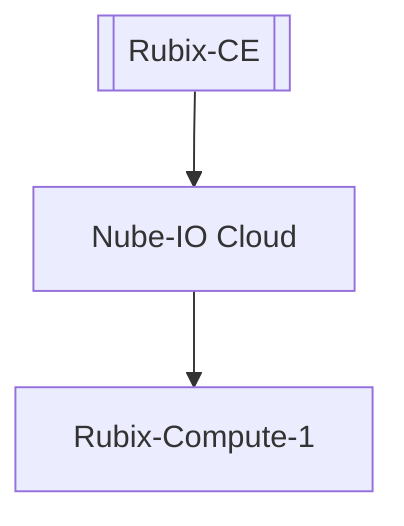
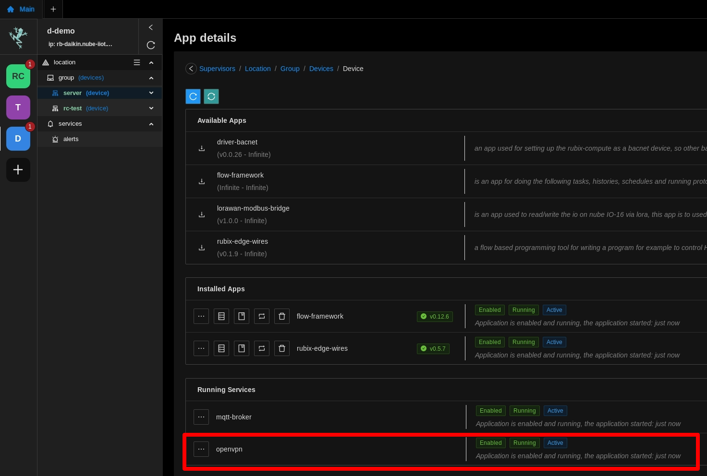
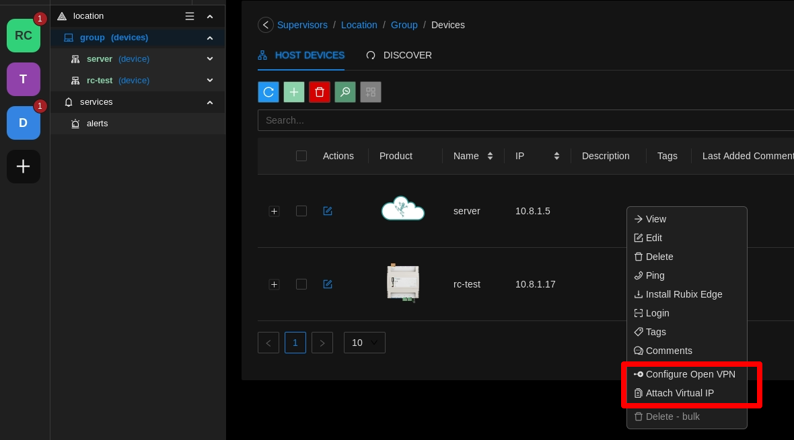

# Add A Rubix-Compute

A rubix compute is to be added under within a supervisor 

:::info
A rubix compute can also act as a supervisor controller
:::

:::info
You can only add a rubix-compute after you have added a **supervisor/location and group**
:::

click on the Add  inside the **device tab**

then you have 3 choices as below

## Adding a local device

This would be when you only have one rubix-compute, and you want to connect to it `without` using the `nube-io cloud`

:::info pre start checks
- a **[rubix-compute](../../hardware/controllers/supervisors/rubix-compute/overview.md)** with network access to the device
- the default IP on `ETH-1` is `192.168.15.10` the 2nd port `ETH-2` is set to `DHCP`
- set you PC on the same network or set a fixed IP on your PC **[networking](../../hardware/controllers/supervisors/rubix-compute/networks.md)**
:::

## Adding a local device to nube-io cloud

This would be when you only have one rubix-compute, and you want to connect to it `with` using the `nube-io cloud`

:::info pre start checks
- a **[rubix-compute](../../hardware/controllers/supervisors/rubix-compute/overview.md)** with network access to the device and a public IP address
- the default IP on `ETH-1` is `192.168.15.10` the 2nd port `ETH-2` is set to `DHCP`
- connect your PC to your local network **[networking](../../hardware/controllers/supervisors/rubix-compute/networks.md)**
:::

:::caution
You need access to your office router or a 4G router to give the rubix-compute a temporary public IP address
This is needed to establish a VPN connection between the cloud and the rubix-compute

Nube-IO uses OpenVPN
:::

## Make sure the OpenVPN service is running

Open the **device/apps**

## Connect to the VPN

Right-Click on the device you want to add the `vpn` to

