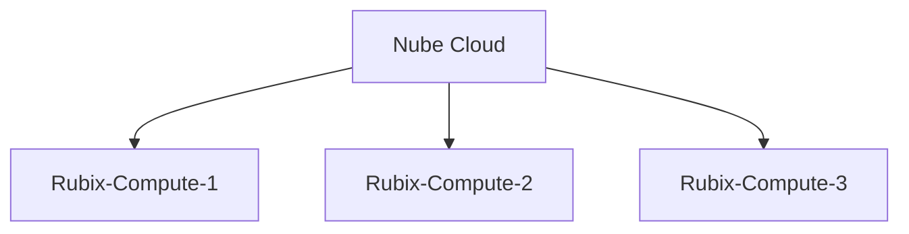

# Add A Rubix-Compute

A rubix compute is to be added under within a supervisor 

:grey_exclamation: A rubix compute can also act as a supervisor controller

## click on the add button
click on the Add 

then you have 3 choices as below

### adding a local device

This would be when you only have one rubix-compute, and you want to connect to it without using the `nube-io cloud`

:::note
pre start checks
- a [rubix-compute](../../overview.md#rubix-Compute) with network access to the device
- the default IP on `ETH-1` is `192.168.15.10` the 2nd port `ETH-2` is set to `DHCP`
- set you PC on the same network or set a fixed IP on your PC  

:::

