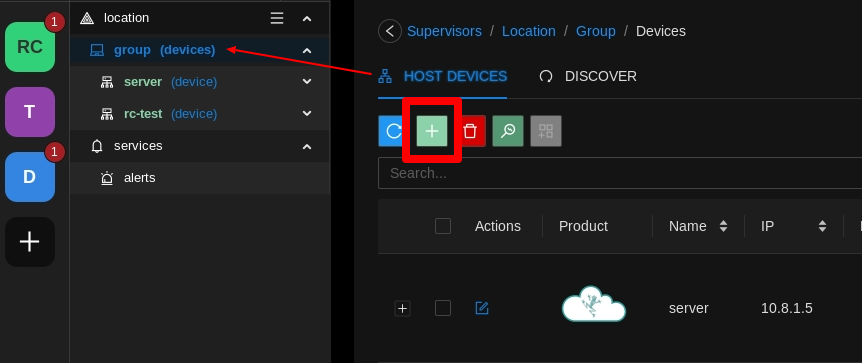

# Hosts/Rubix Computes

A Rubix Compute (host) is to be added under a Supervisor.

:::caution
You must have already added a `supervisor`, `location` & `group`, See adding a **[supervisor](supervisor.md)**
:::

:::info
A Rubix Compute can also act as a supervisor controller  
You can only add a ubix Compute after you have added a **supervisor/location and group**
:::

click on the Add  inside the **device tab**

Then you have 3 choices as below:

## Adding a Local Device

This would be when you only have one Rubix Compute, and you want to connect to it `without` using the `Nube iO cloud`.

:::info pre start checks
- A **[rubix-compute](../../hardware/controllers/supervisors/rubix-compute/overview.md)** with network access to the
  device
- The default IP on `ETH-1` is `192.168.15.10` the 2nd port `ETH-2` is set to `DHCP`
- Set you PC on the same network or set a fixed IP on your PC **[networking](../../hardware/controllers/supervisors/rubix-compute/networks.md)**
:::

## Adding a Local Device to Nube iO Cloud

Adding a local device to the Nube iO Servers will only be required when you only have one Rubix Compute, and you want to connect to it `with` using the `Nube iO Cloud`

:::info pre start checks
- You first need to add the device the same as above!
- A **[rubix-compute](../../hardware/controllers/supervisors/rubix-compute/overview.md)** with network access to the device and a public IP address
- The default IP on `ETH-1` is `192.168.15.10` the 2nd port `ETH-2` is set to `DHCP`
- Connect your PC to your local network **[networking](../../hardware/controllers/supervisors/rubix-compute/networks.md)**
:::

:::caution
You need access to your office router or a 4G router to give the rubix-compute a temporary public IP address.
This is needed to establish a VPN connection between the cloud and the rubix Compute.
:::

### Make sure the OpenVPN service is Running

Open the **device/apps**

### Connect to the VPN

Right Click on the device you want to add the `vpn` to

