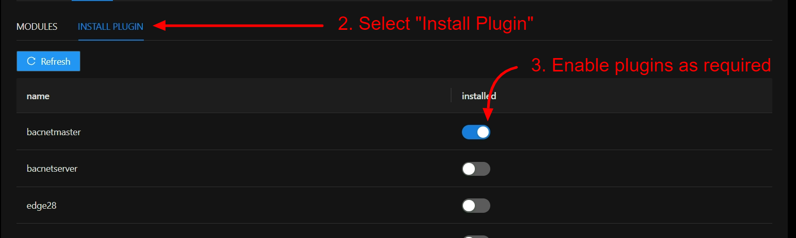

# Modules

# Overview

**Modules/Plugins** are a way to extend the ability of rubix-os for example rather than bloating the
Rubix Compute with every feature or protocol's the user can add/remove **Modules/Plugins** as required.

The following features are supported

* Reading point values (sensors, logical)
* Writing to points, priority array supported
* Writing time schedules
* Mass control operations, for example mass updates of time schedules (Command Groups)
* Updates to the gateway app's

# A list of common Modules/Plugins

| Name         | Is a Protocol      | Supports  Networks | Description                                                                   | Use Case                                             | 
|--------------|--------------------|------------------------|-------------------------------------------------------------------------------|------------------------------------------------------|
| System       | Yes rest-api       | Yes                    | A generic proxy network/devices/points that are not related to any protocol   | Schedules, proxy points                              | 
| Lora         | Yes LoRa           | Yes                    | Used with nube-io lora sensors                                                | When you want to use wireless sensors                | 
| LoRaWAN     | Yes LoRaWAN        | Yes                    | Used with any supported LoraWAN sensors                                       | When you want to add LoRaWAN sensors                 | 
| BACnet master | Yes BACnet Master  | Yes                    | To read/write to BACnet device                                                | When you want to be a BACnet master                  | 
| Modbus       | Yes Modbus RTU/TCP | Yes                    | To read/write to Modbus device, can be either vai rs485 or modbus TCP         | When you want to be a Modbus master                  | 
| History      | No                 | No                     | Internal service for proving histories for points                             | When you want to have local or cloud historical data | 
| Postgres     | No                 | No                     | Send data into postgres (history plugin is needed to use the postgres plugin) | Used for edge to cloud histories for points          | 

## Install A Plugin

* To install a plugin toggle the button to the `on` position, then enable the plugin via the select and click on the button `enable plugin`.
* To uninstall a plugin toggle the button to the `off` position.

:::info enable plugin
If a plugin isn't enabled you will get errors when trying to add the plugin.
:::

:::info
This will not delete the network if you uninstall an plugin that was already installed.
:::

