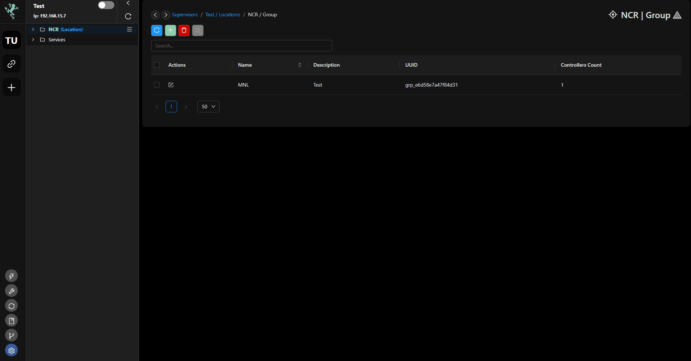
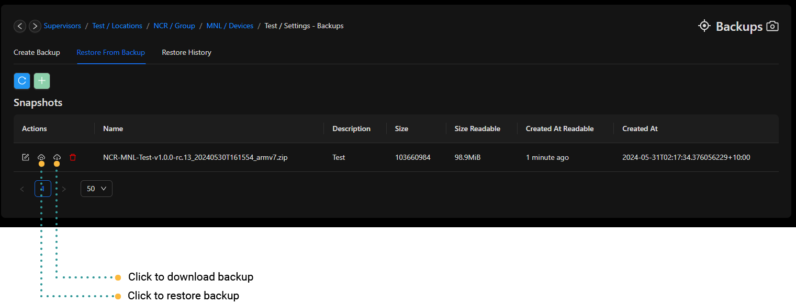

# Backups & Templates
## Overview

### Templates

Templates outlines the particulars of a system, including installed applications, modules, and data such as wires and ROS data. When restoring from a template, the process involves reinstalling each defined application and module, followed by the restoration of data. This method reconstructs the system environment piece by piece.

### Backups

Backups, on the other hand, involve capturing a comprehensive snapshot of a device, encompassing all its contents and configurations. This allows for the restoration of the entire system to its original state on either the same device or a different one. It mirrors the complete environment by duplicating everything, ensuring an exact replication of the setup.

:::caution
To create a backup, you'll require either 2 x Rubix Computes or 1 x Rubix Compute along with 1 x Nube iO Cloud account.
:::

The backup & restoring service allows users to take a backup of a Rubix Compute or Nube iO Cloud. Once a backup is created, users can perform the following actions:

- Save the backup to your PC for safe keeping
- Restore a backup you took for a particular device

:::caution
A backup is stored in supervisor device (this could be the Rubix Compute or Nube iO Cloud)  
:::

## Create a Snaptshots Backup
To create a backup in Rubix CE, follow these steps:
1. Open the device for which you wish to take a backup.
2. Navigate to the **settings->backups** section.
3. Click on  to initiate the backup process.
4. Name your backup accordingly and click OK
5. The backup will then be shown with the status “Creating”
6. Once the backup is successfully created the Status will change to “Created”

Following these steps will allow you to generate a backup of the selected device in Rubix CE.

## Restore from Snapshots backup
To restore from a backup in Rubix CE, follow these steps:
1. Open the device you want to restore a backup for.
2. Navigate to the **settings->backups** section.
3. Look for the **Restore Icon** and click on it to initiate the restoration process.

Following these steps will allow you to restore a backup for the selected device in Rubix CE.

:::info
Performing a backup or restore in Rubix CE may take several minutes, depending on factors such as the size of historical data and application files associated with the backup. Be prepared to wait for a few minutes while the restoration process completes
:::

## Restore History

In Rubix CE, there is a dedicated tab displaying the history of when users performed restores of the device you are currently working with. This feature allows you to track and review past restoration activities for the device, providing valuable insights into its maintenance and management history.

## Network/Device/Points Import/Export 
### via Backup
**Export**
1. Navigate to the Host, then go to Network/Device/Points.
2. Right-click on the Network/Device/Points you want to backup and select `Export`.
3. In the popup window, choose `Backup` from the dropdown menu.
4. Provide a name for your backup and click on the `Export` button.

**Import**
1. Click on the `Import` button within Network/Device/Points.
2. Select Backup.
3. In the popup window, choose the backup you wish to import and click `Ok`.
4. Wait for the process to complete.

### via JSON File
**Export**
1. Navigate to the Host, then go to Network/Device/Points.
2. Right-click on the Network/Device/Points you want to backup and select `Export`.
3. In the popup window, choose `JSON File` from the dropdown menu.
4. Provide a name for your backup and click on the `Export` button.

**Import**
1. Click on the `Import` button within Network/Device/Points.
2. Select JSON.
3. Open the JSON file you saved during the export process using a text editor like Notepad or any software capable of reading JSON files. 
4. Copy the entire content from the JSON file.
5. Paste the copied text into the popup window in your CE. Click `Next`.
6. Click `Import` and then `Close` to complete the import process.

### via JSON String
**Export**
1. Navigate to the Host, then go to Network/Device/Points.
2. Right-click on the Network/Device/Points you want to backup and select `Export`.
3. In the popup window, choose `JSON String` from the dropdown menu.
4. Copy the entire JSON String, and saved it by pasting it to any test editor application. Save the file.

**Import**
1. Click on the `Import` button within Network/Device/Points.
2. Select JSON.
3. Open the JSON file you saved during the export process using a text editor.
4. Copy the entire content from the JSON file.
5. Paste the copied text into the popup window in your CE. Click `Next`.
6. Click `Import` and then `Close` to complete the import process.

### via Excel
**Export**
1. Navigate to the Host, then go to Network/Device/Points.
2. Right-click on the Network/Device/Points you want to backup and select `Export`.
3. In the popup window, choose `Excel` from the dropdown menu.
4. Provide a name for your backup and click on the `Export` button.

**Import**
1. Click on the `Import` button within Network/Device/Points.
2. Select Excel.
3. Drag the excel file you saved earlier on the export process to the pop up window on CE. Click `Next`.
4. Click `Import` and then `Close` to complete the import process.

