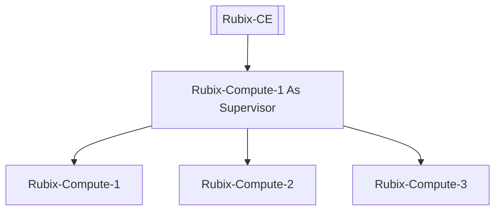
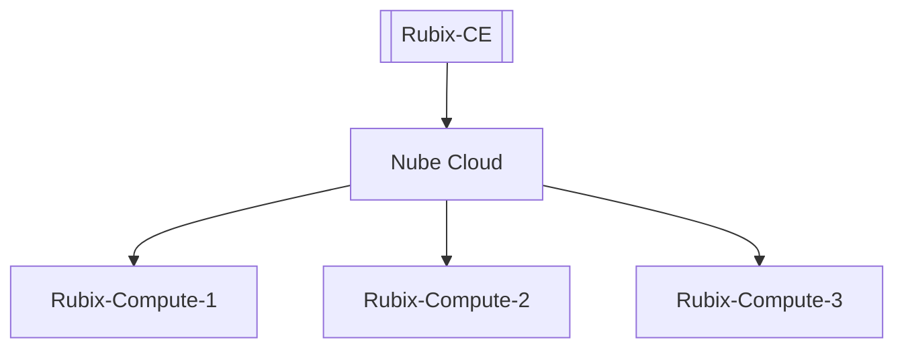
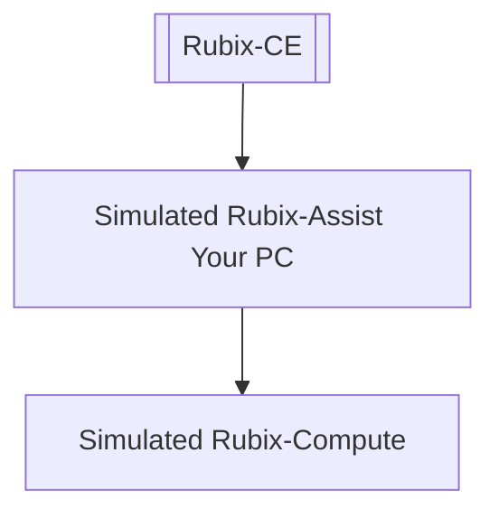

# Supervisor

The Rubix Platform CE (Computer Edition) application can be used to setup and program multiple instances of the Rubix Assist (each customer
has their own instance of Rubix Assist running in the cloud or on premises) so the user of Rubix CE can engineer multiple
sites or devices at once.

An admin can generate multiple tokens for each site specific customer and can also remove the customer from the site by
revoking the specific token. See 'Generating a Token'.

:::info Before starting you need the following:
1. A **[Nube iO Cloud Account](docker.md#nube-io-cloud-account)**
2. And/or a Nube iO **[Rubix Compute](../../hardware/controllers/supervisors/rubix-compute/overview.md)**
:::

## Adding a Supervisor

1. Open the Supervisor page
2. Click on the Add 
3. Follow the steps in the wizard

:::Info The default IP's of a Rubix Compute are: 
ETH 1: `192.168.15.10`  
ETH 2: `AUTO DHCP`  
Please contact `Nube iO support` for default username and password. Email support@nube-io.com
:::

The wizard will follow you through all the required steps.

### Name

The name of the **Supervisor**

### Short Name

The name that will appear on the menu sidebar

### Display Colour

The colour that will appear on the `sidebar`

### Description

Optional description of the setup of the **Supervisor**

### Enable

- If you `enable` **Supervisor** it will appear on the `sidebar`
- If you `disable` **Supervisor** it will appear on the `sidebar`

:::Tip
Once the  **Supervisor** is added you can `right-click` to **Enable Supervisor** or **Disable Supervisor**
:::

### Network Information

You will have 3 optons to choose from as below:

## Option 1: Using a Rubix Compute as the master

:::Info
* A Rubix Compute is required to use this option.
* This option is the simplest way to get started with Nube iO products.
:::

## Option 2: Using a Nube iO Cloud Account

:::Info
* Both a Rubix Compute and a Nube iO Cloud Account is required to use this option.
* Please contact `nube-io support` for access to a Nube iO Cloud Account. Email support@nube-io.com
:::

## Option 3: Using your PC as a Running Docker

:::info
* No hardware is need for testing this.
* You must install docker on your local PC.
:::

:::Caution
This option is for advanced use only see: **[setup of docker](docker.md)**
:::

# Right-Click Options

## Ping 
Will ping the supervisor on the Network.

## Enable/Disable Supervisor 
Is the same as Edit and will change the value of `enable`, when enabled it will display on the side-bar.

