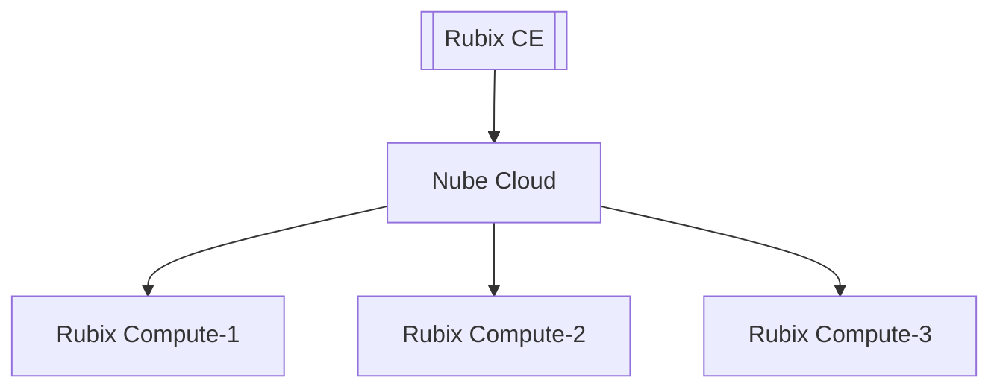
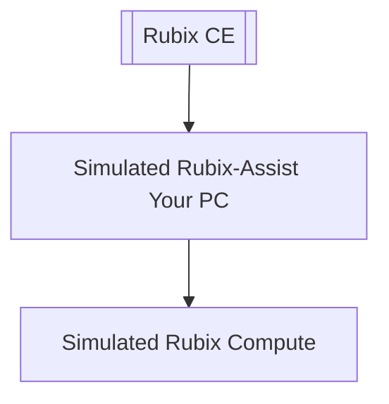

# Supervisor

The Rubix Platform CE (Computer Edition) application enables the setup and programming of multiple 
instances of Rubix Assist. Each customer has their own instance of Rubix Assist, which can be running
either in the cloud or on-premises. This setup allows users of Rubix CE to engineer multiple sites or 
devices simultaneously.

Administrators have the ability to generate multiple tokens for each site-specific customer. Additionally, 
they can revoke access for a specific customer from a site by revoking the corresponding token. For 
detailed instructions, please refer to the section on 'Generating a Token'.

:::info Before starting you need the following:
1. **[Nube iO Cloud Account](docker.md#nube-io-cloud-account)**.
2. And/Or Nube iO **[Rubix Compute](../../hardware/controllers/supervisors/rubix-compute/overview.md)**.
:::

## Adding a Supervisor

1. Open the Supervisor page.
2. Click on the Add .
3. Follow the steps in the short clip.

:::info Default IP(s) of Rubix Compute: 
ETH 1: `192.168.15.10`  
ETH 2: `AUTO DHCP`  
For the default username and password, please contact Nube iO support at support@nube-io.com. 
:::

Short clip below will guide you through the configuration.

## Supervising Hosting Option
A supervisor can either be a Rubix Compute or Rubix OS running in the cloud. A Supervisor serves as the entry point to the functionalities and navigation of Rubix OS. The supervisor's function is to host and manage all Rubix Compute devices.

### Option 1: Nube iO Device
:::info
* This option requires a Rubix Compute.
* It is the simplest method to commence with Nube iO products.
:::

### Option 2: Nube iO Cloud

:::info
* This option necessitates both a Rubix Compute and a Nube iO Cloud Account.
* Please contact `nube-io support` at support@nube-io.com for access to a Nube iO Cloud Account.
:::

### Option 3: Personal Computer via Device Simulation

:::info
* No hardware is needed for testing this option.
* Install docker on your local PC.
:::

:::caution
This option is for advanced use only. Please refer to the **[setup of docker](docker.md)** guide.
:::

## Address
IP or web address of the Nube iO device/cloud you wish to connect.

## Port
Port of the Nube iO device/cloud you wish to connect. Default port: 1659.

## Supervisor Name

Name of the **Supervisor**.

## Short Name

Name that will appear on the menu `sidebar`.

## Description

An optional description of the **Supervisor**.

## Advance Options

### Supervisor Sidebar Icon Color

Set the background color of the `sidebar` supervisor icon.

### Supervisor Group Name

Set group name to empty to remove a supervisor from a group. Supervisors assigned with the same group name will be put into the same group.

### Supervisor Latitude

Set the latitude of a supervisor.

### Supervisor Longitude

Set the longitude of a supervisor.

:::tip
Once the  **Supervisor** is created it is automatically enabled. `right-click` the supervisor's name to **Enable Supervisor** or **Disable Supervisor**.

- `Enable` **Supervisor** will display it on the `sidebar`.
- `Disable` **Supervisor** remove it from the `sidebar`.
:::

## Ping Supervisor
During the setup, you will have an option to ping the supervisor to verify that the destination address exists and can accept requests from the Rubix.

## Configure Token 
A Rubix User Token is required for accessing the functionalities of a supervisor. A user can generate multiple tokens for each site specific user and can also add or remove new users by providing or revoking specific user tokens.

## Install Rubix OS
Select and install the desired Rubix OS version for the newly created supervisor.