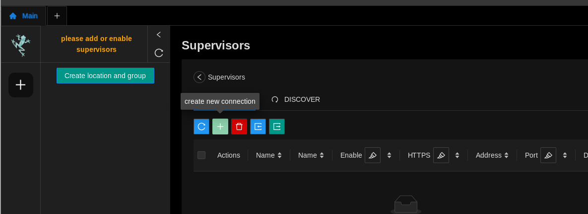
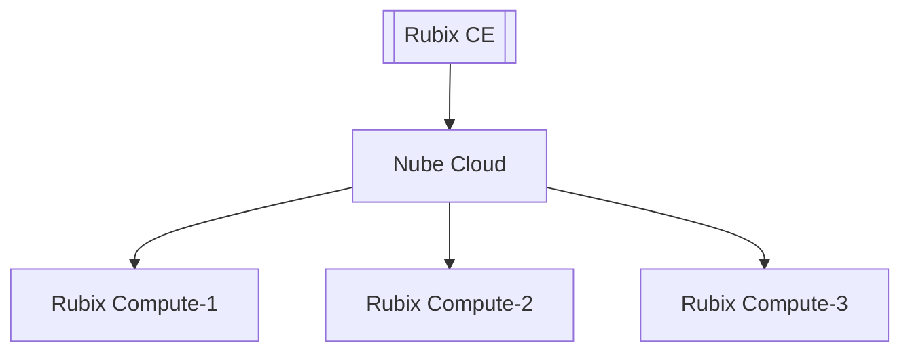
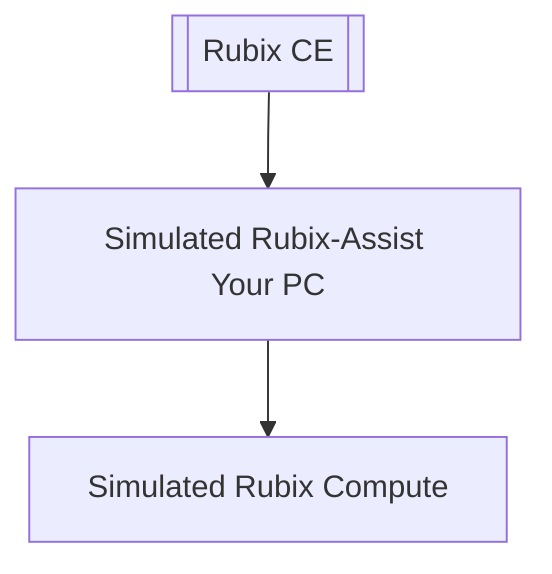
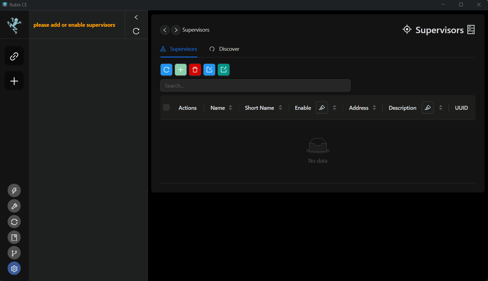

# Supervisor

The Rubix Platform CE (Computer Edition) application enables the setup and programming of multiple 
instances of Rubix Assist. Each customer has their own instance of Rubix Assist, which can be running
either in the cloud or on-premises. This setup allows users of Rubix CE to engineer multiple sites or 
devices simultaneously.

Administrators have the ability to generate multiple tokens for each site-specific customer. Additionally, 
they can revoke access for a specific customer from a site by revoking the corresponding token. For 
detailed instructions, please refer to the section on 'Generating a Token'.

:::info Before starting you need the following:
1. **[Nube iO Cloud Account](docker.md#nube-io-cloud-account)**.
2. And/Or Nube iO **[Rubix Compute](../../hardware/controllers/supervisors/rubix-compute/overview.md)**.
:::

## Adding a Supervisor

1. Open the Supervisor page.
2. Click on the Add .

:::info Default IP(s) of Rubix Compute: 
ETH 1: `192.168.15.10`  
ETH 2: `AUTO DHCP`  
For the default username and password, please contact Nube iO support at support@nube-io.com. 
:::

3. Add Supervising Hosting Option  

**Supervising Hosting Option**
 A supervisor can either be a Rubix Compute or Rubix OS running in the cloud. A Supervisor serves as the entry point to the functionalities and navigation of Rubix OS. The supervisor's function is to host and manage all Rubix Compute devices.   

**Option 1: Nube iO Device**
:::info
* This option requires a Rubix Compute.
* It is the simplest method to commence with Nube iO products.
:::

**Option 2: Nube iO Cloud**

:::info
* This option necessitates both a Rubix Compute and a Nube iO Cloud Account.
* Please contact `nube-io support` at support@nube-io.com for access to a Nube iO Cloud Account.
:::

**Option 3: Personal Computer via Device Simulation**

:::info
* No hardware is needed for testing this option.
* Install docker on your local PC.
:::

:::caution
This option is for advanced use only. Please refer to the **[setup of docker](docker.md)** guide.
:::

4. Insert the IP or web address of the Nube iO device/cloud you wish to connect.

5. When opting for Nube iO device hosting, you have the flexibility to select your preferred port for connection and specify whether it should use HTTPS or HTTP. The default port is set at 1659. Click `Next`

6. Add a Supervisor Name.

7. Add the Supervisor sidebar icon name, which will be displayed in the menu `sidebar`. It should consist of a maximum of four characters.

8. The Supervisor description is optional. Feel free to provide a brief description of the Supervisor as needed.

9. Advanced options are also optional. Below are the descriptions for each:

    * **Supervisor Sidebar Icon Color:** Define the background color for the Supervisor icon in the sidebar.

    * **Supervisor Group Name:** Assign a group name to supervisors. Leave empty to remove a supervisor from a group. Supervisors with the same group name will be grouped together.

    * **Supervisor Latitude:** Specify the latitude for a supervisor.

    * **Supervisor Longitude:** Specify the longitude for a supervisor.

10. Ping Supervisor to check the connection to the newly added supervisor. You may opt to skip the process.
11. To configure the Rubix User token, you can generate it by logging in with your `username` and `password`. If you haven't been provided with login details or a token, please reach out to <u>support@nube-io.com</u> for assistance. If you want to install a new Rubix OS version on your supervisor, click `Save Token & Next`. Otherwise, click `Save & Quit`.
12. From the dropdown menu, select your preferred Rubix OS version. To install the new version, click `Save & Quit`; otherwise, click `Quit` to keep the current installation.
Short clip below will guide you through the configuration.

:::tip
Once the  **Supervisor** is created it is automatically enabled. `right-click` the supervisor's name to **Enable Supervisor** or **Disable Supervisor**.

- `Enable` **Supervisor** will display it on the `sidebar`.
- `Disable` **Supervisor** remove it from the `sidebar`.
:::