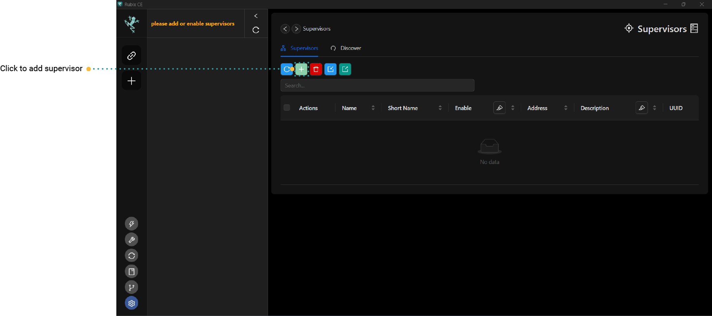

# Supervisor

The Rubix-Platform-CE application can be used to setup and program multiple instances of the Rubix-assist (each customer
has their own instance of Rubix-assist running in the cloud or on premises) so the user of CE can engineer multiple
sites at once.

An admin can generate multiple tokens for each site specific customer and can also remove the customer from the site by
revoking the specific token. See 'Generating a Token'.

:::info before starting you need the following
1. A **[nube-io cloud account](docker.md#nube-io-cloud-account)**
2. And or a nube-io **[rubix-compute](../../hardware/controllers/supervisors/rubix-compute/overview.md)
:::

## Adding a Supervisor

1. open the Supervisor page
2. click on the Add 
3. Follow the steps in the wizard

### name

The name of the **Supervisor**

### short name

The name that will appear on the sidebar

### display colour

The colour that will appear on the `sidebar`

### description

Optional description of the setup of the **Supervisor**

### enable

- If you `enable` **Supervisor** it will appear on the `sidebar`
- If you `disable` **Supervisor** it will appear on the `sidebar`

:::tip
Once the  **Supervisor** is added you can `right-click` to **Enable Supervisor** or **Disable Supervisor**
:::

### Network information

then you have 3 choices as below

## Option 1 Using a rubix-compute as the master

:::info

* a rubix-compute is needed to use this method
* this is the simplest way to get started with nube-io
  :::

## Option 2 Using nube cloud

:::info

* a rubix-compute is needed to use this method & a cloud account is needed
* contact nube support to get a cloud account
  :::

## Option 3 Using your pc running docker

:::info

* no hardware is need for testing this
* you must install docker
  :::

:::caution
this is for advanced use only

see: [setup of docker](docker.md)
:::

# Right-Click Options