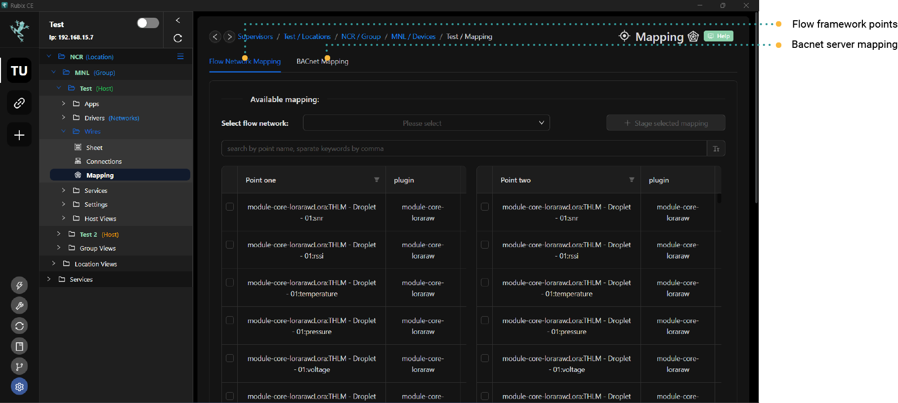

## Mapping

Mapping in Rubix Wires facilitates the conversion of data from one protocol to another. For instance:

- Map LoRa® sensors to a BACnet-Server, enabling integration of LoRa® sensors into a third-party BMS system.
-Map a LoRa® sensor with motion detection capability to control the on/off state of a relay on a Modbus-RTU device.

:::info Before proceeding
To proceed effectively, it's vital to confirm that you've installed the necessary apps:
* **[apps](../setup/apps.md)** **rubix-edge-wires**
* **[apps](../setup/apps.md)** **flow-framework**
* **[apps](../setup/apps.md)** **driver-bacnet**
:::

## Flow-Framework mapping

:::info
To begin, navigate to the `Wires` tab and add/setup a `Flow-Network` node. Opt for a name that is straightforward to recall.
::: 

1. Open the device you wish to work on.
2. Navigate to the **Wires/Mapping** section.
3. Click on the `Flow network mapping` tab.
4. Select the `Flow-Network` that was previously added in Rubix Wires.
5. Choose the point you want to map From in the `Point-One Table`.
6. Select the point you want to map To in the `Point-Two Table`.
7. Click on the **Stage Selected Mapping** button. This action will add the points in the Staged mapping table.
8. Add as many mappings as you require.
9. Once finished, click on the **Create/Delete** Mapping button.
10. After completing this step, you will be redirected to the Rubix Wires flow editor. Ensure to download the new mapping that was added.

## BACnet-Server mapping

:::info
Prioritize opening the Wires tab and proceed to add/setup a Flow-Network node. Opt for a name that is straightforward to recall.  
Subsequently, revisit the Wires tab and configure a BACnet-Server node. Opt for a name that is straightforward to recall.
:::

1. Access the device you intend to work on.
2. Navigate to the **Wires/Mapping** section.
3. Click on the `BACnet Mapping` tab.
4. Choose the previously added `Flow-Network` from Rubix Wires.
5. Select the point you wish to map.
6. Click on the **Stage Selected Mapping** Button. This action will add the selected points to the Staged mapping table.
7. Add as many mappings as necessary.
8. Once completed, click on the **Create/Delete Mapping** Button.
9. Afterward, you will be directed to the Rubix Wires flow editor. Remember to download the newly added mapping.

