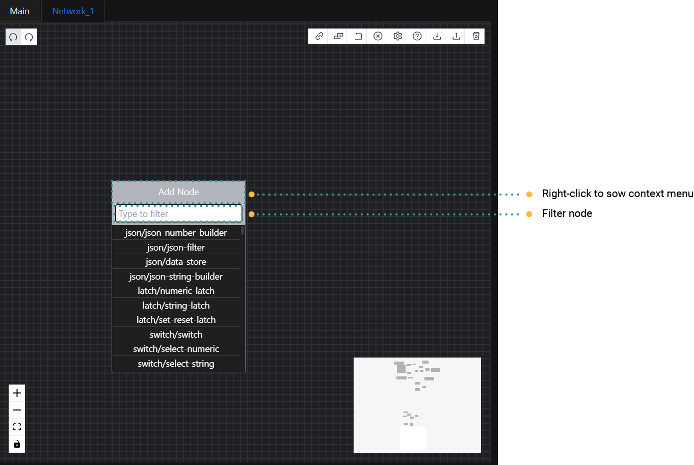
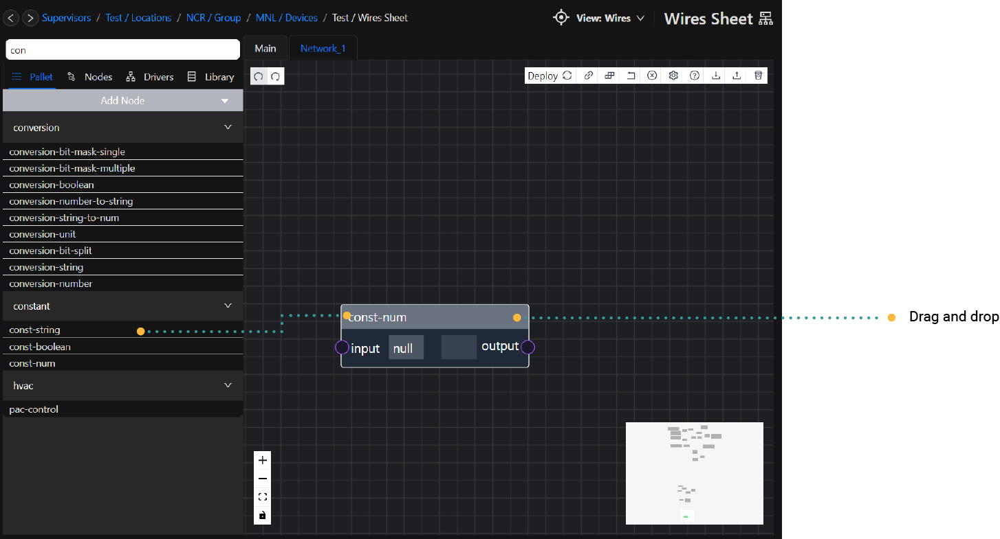
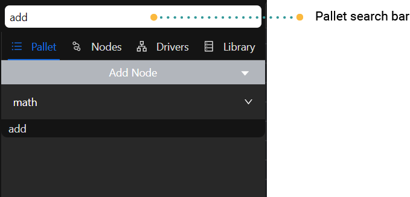
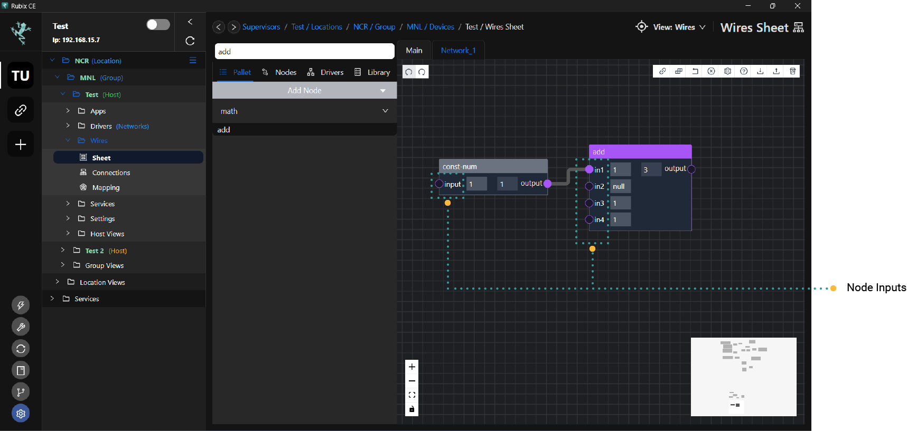
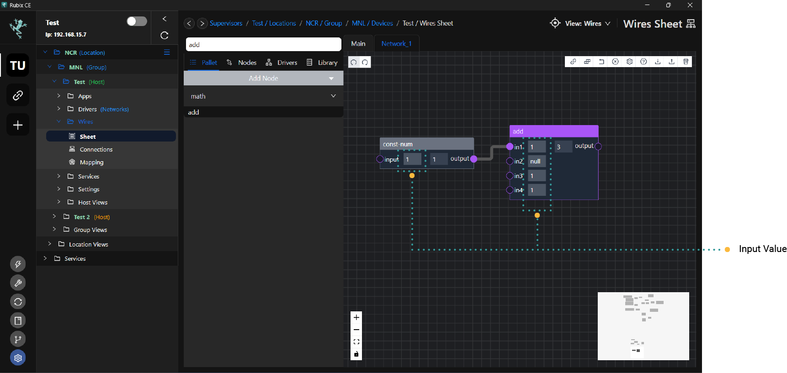
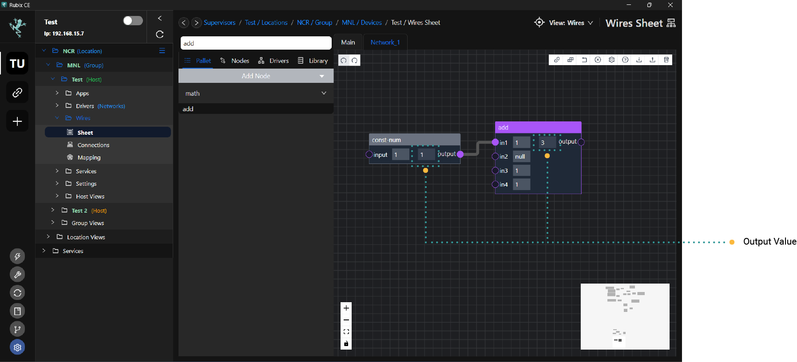

# Using The Editor

# Adding Nodes

## Adding Nodes from the Context Menu

Right-clicking on the Editor Pane opens the Context Menu. By clicking `Add` you will see a list of all the available
node groups. Clicking a group will show the nodes available in that group. Clicking a node will add it to the Editor
Pane.

## Adding Nodes from the Node Palette

The Node Palette shows the node groups. Clicking a node group will expand that group, showing the available nodes.
Dragging a node from the Node Palette to the Editor Pane will add it to the Editor Pane.

# Node Palette Search

To find nodes more easily in the Node Palette, a search feature is located at the top of the Node Palette. Typing in the
`search` bar will filter the nodes shown in the Node Palette to only those which match the search terms.

# Cloning nodes

Nodes can be cloned (duplicated) by selecting `ctrl-d`

# Removing Nodes

Select a node by clicking on it and then use the delete key to delete the node
To remove multiple nodes, hold the shift key and select(click) the desired nodes to be removed; An outline will appear
around the selected nodes. Once selected either press the delete key on the keyboard.

# Node Settings

Each node on the Editor Pane has settings that are used to configure its function or labelling. Settings are configured
and saved for each individual node.
To edit a node settings **double-click** on the node or **right click** and edit settings

# Node Inputs and Outputs

Nodes have different inputs and outputs based on the specific function they perform. Many nodes have settings which will
change the available inputs and outputs.

## Node Inputs

Node inputs provide values to be used in computing the node’s outputs. Wire links can be connected to the left hand side
of node input slots. The image below shows the 4 inputs of a `min-on-off` node.

## Node Inputs value

A node supports the option to write a value directly in the input rather than connecting in another node

# Variable Input Counts

Many nodes have a setting which will create/remove node inputs.

Example of some nodes that support this: **Math/Add** **Bool/And**

# Node Outputs

Node outputs are the results of a nodes specific function. Wire links can be connected from the right hand side of node
output slots. The image below shows the 1 output of a const-num node.

