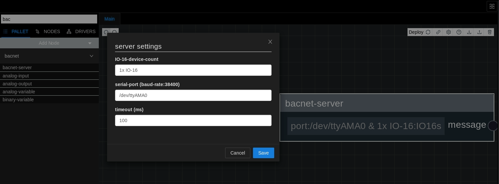

## About BACnet
The server node serves the purpose of reading and writing values to the **[driver-bacnet](../setup/apps.md)**. This functionality enables Rubix Compute to be integrated into a BACnet network.

:::tip
See also: **[Tutorials BACnet-device](../../tutorials/bacnet-device.md)**
The BACnet-server node serves two primary use cases:

1. Integrating hardware input/output (e.g., sensors and 0-10dc) into Rubix Compute by adding the **[Nube-IO IO-16](../../hardware/controllers/io-controllers/IO-16/overview.md)**.
2. Adding proxy points (Analog Values and Binary Values) to the driver-bacnet.
Before proceeding, ensure you have installed the required apps, particularly **[driver-BACnet](../setup/apps.md)**.
:::

:::danger driver networks conflict
In Rubix, you can't simultaneously add a **Modbus network** in the driver's settings and the **BACnet-server** node using the <u>same serial-port</u>. You have to **choose one** or the other, as they cannot coexist on the same port.
:::

## Setup

### Add the bacnet-server node
1. Open the **Rubix Wires** interface.
2. Locate and select the option to add a new node.
3. Choose the **BACnet-server** node from the available options.
4. Configure the node by setting the number of IO-16s if applicable to your use case.
5. Set the serial port according to your hardware setup.
5. Save/Deploy the configuration.

### Adding points
Following steps below allows you to effectively add points to the BACnet-server node in Rubix Wires.
1. Open the BACnet-server node by right-clicking and selecting **Open sub flow**.
2. Once inside, you can add nodes by right-clicking or dragging from the palette.
3. Add a new node, selecting either `AI (Analog Input)`, `AO (Analog Output)`, or `AV (Analog Value)`.
4. Set the node name to specify the BACnet object name for the point.

:::tip
Ensure to set the `node name` to accurately reflect the point name on the `BACnet network`.
:::

**BACnet point nodes**

| Node Name       | Category | Use Case                                                                 | is writeable              | 
|-----------------|----------|--------------------------------------------------------------------------|---------------------------|
| analogue-input  | bacnet   | Is only used when the IO-16s are added (will work with UIs)              | read only                 |
| analogue-output | bacnet   | Is only used when the IO-16s are added (will work with UOs)              | writeable via in14 & in15 |
| analogue-value  | bacnet   | to read and and write values to AVs on the bacnet-server, eg a set-point | writeable via in14 & in15 |
| binary-value    | bacnet   | to read and and write values to BVs on the bacnet-server, eg an enable   | writeable via in14 & in15 |

### Adding IO-16s

Adding upto 4x IO16s will make the Rubix Compute a BACnet-ip IO device

:::info
**[more info on adding IO16s](../../hardware/controllers/supervisors/rubix-compute/user-manual#IO-16)**
:::

### Adding a AI or AO

:::caution
In the flow-framework, there's no necessity to add a Modbus network to communicate with the IO-16s.
:::

:::caution
To configure the BACnet-Server with the desired number of IO-16s, you typically access the BACnet-Server settings interface and input the quantity of IO-16s you intend to add.
:::

To proceed, a systematic outline of each step for adding UI-1 on IO-2 is as follows:

1. Power down the Rubix Compute.
2. Connect 2x IO16s to the Rubix Compute. Remember, the IO-16s are powered via the Rubix Compute.
3. Set the dip switches on IO16 number 1 to address 1 and on number 2 to address 2. Ensure the baud rate is set to 38400 as well. 
4. Refer to the documentation for **[more info on setting up the IO-16s](../../hardware/controllers/io-controllers/IO-16/parameters.md)**.
5. Power up the Rubix Compute.
6. Open the BACnet-server node.
7. Add an Analog Input (AI) node to the BACnet-server configuration.
8. Right-click on the newly added AI node and select `Settings`.
9. Configure the **IO Device Number to 2**, indicating the 2nd IO-16.
10. Set the **UI Number to 1**, representing UI1.
11. This configuration will assign the Analog Input as **AI9**.

:::tip
Given that the IO-16 utilizes UOs (Universal Outputs) and UIs (Universal Inputs), only AOs (Analog Outputs) and AIs (Analog Inputs) can be added.

But we can employ UI-1 as a DI (Digital Input), an AI node should be added and configured to address 1 (AI1). Subsequently, it should be set as a digital input.
:::

:::tip writing to a UO as digital
To enable this functionality:

Add an AO (Analog Output) node and set its settings to operate in a digital mode. Configure the point to accept any value greater than 1 to activate the Digital Output (DO). For instance, the point should interpret values like `true/false, 1/0, or 10/0` to control the DO.
:::

## UI/UO to BACnet Addressing

### Example for inputs

| Device Address | IO Number | BACnet address | 
|----------------|-----------|----------------|
| 1              | UI1       | AI1            | 
| 1              | UI2       | AI2            | 
| 1              | UI3       | AI3            | 
| 1              | UI4       | AI4            | 
| 1              | UI5       | AI5            | 
| 1              | UI6       | AI6            | 
| 1              | UI7       | AI7            | 
| 1              | UI8       | AI8            | 
| 2              | UI1       | AI9            | 
| 3              | UI1       | AI17           | 

This device addressing can be extended until you reach the limit of 4x IO1-6 devices.

### Example for outputs

| Device Address | IO Number | BACnet address | 
|----------------|-----------|----------------|
| 1              | UO1       | AO1            | 
| 2              | UO1       | AO9            | 
| 3              | UO1       | AO17           | 
