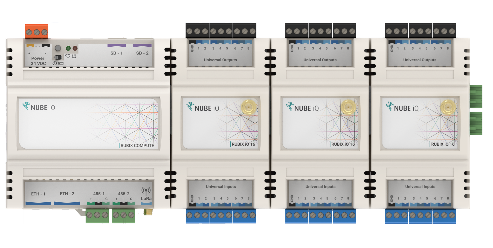

# BACnet

The server node is used to read/write value to the **[driver-bacnet](../setup/apps.md)** so the rubix-compute can be
added to a BACnet-network

The BACnet-server node has 2x use cases

1. Adding the IO (hardware input/output eg: sensors and 0-10dc) to the rubix-compute, via adding the *
   *[Nube-IO IO-16](../../hardware/controllers/io-controllers/IO-16/overview.md)**
2. Adding proxy points (AVs and BVs) to the driver-bacnet

:::info Important thing to note before proceeding:
* Install required **[apps](../setup/apps.md)** **driver-bacnet**
:::

# Setup

## Add the bacnet-server node

1. Add the bacnet-server node
2. set the number of IO-16s if applicable to your use case, and also set the serial port

## Adding points

1. Open the bacnet-server node by right-click and `Open sub flow`
2. Once inside you can right-click to add nodes or drag from the pallet

BACnet point nodes

| Node Name       | Category | Use Case                                                                 | is writeable              | 
|-----------------|----------|--------------------------------------------------------------------------|---------------------------|
| analogue-input  | bacnet   | Is only used when the IO-16s are added (will work with UIs)              | read only                 |
| analogue-output | bacnet   | Is only used when the IO-16s are added (will work with UOs)              | writeable via in14 & in15 |
| analogue-value  | bacnet   | to read and and write values to AVs on the bacnet-server, eg a set-point | writeable via in14 & in15 |
| binary-value    | bacnet   | to read and and write values to BVs on the bacnet-server, eg an enable   | writeable via in14 & in15 |

## Adding IO-16s

Adding upto 4x IO16s will make the rubix-compute a BACnet-ip IO device

:::info
**[more info on adding IO16s](../../hardware/controllers/supervisors/rubix-compute/overview.md#io-add-on-modules)**
:::

