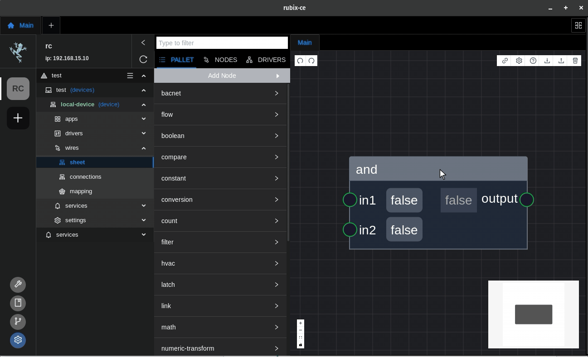

# Sharing A Flow

## Exporting
You can use the export icon or ctrl-e

## Importing
You can use the import icon or ctrl-i

:::tip
Once a flow is imported it needs to be deployed to save the flow to the controller

Hit **Ctrl-s** to deploy the flow
:::

