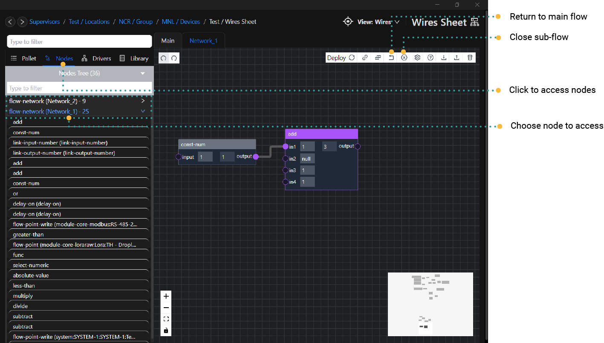

# Sub-flows

:::info reference
`folder` and `sub-flows` can be referred to as the same thing.   
A `sub-flow` is a concept of putting a grouping nodes into a `folder` to be reused
:::

Folder nodes are located in the `folder` node category. Folder nodes are containers that can hold other nodes. Each
Folder contains a separate wire-sheet where more nodes and logic flows can be created. They are used to separate and
organise wire-sheets.

## Child Nodes
Child Nodes are nodes that can only be added inside a `folder` node.

# Nodes that are folder's

| Node Name     | Category | Use Case                                      | Child Nodes                | 
|---------------|----------|-----------------------------------------------|----------------------------|
| Folder        | sub-flow | A write a program that you want to re-use     | folder-inputs and outputs  |
| Flow-Network  | flow     | To read/write points from **flow-framework**  | point-read and point-write |
| BACnet-Server | bacnet   | To read/write points to app **driver-bacnet** | AI, AO, AV, BV             |

# Creating Folders

Folders can be created like other nodes by adding them to the Editor Pane. Folders are located in the `folder` node
category. Folders can also be created by selecting one or more nodes, and then selecting ‘Move To Container’ from the
context menu; this will move all selected nodes and wire links to the new Folder.

# Folder Navigation

When a Folder node is created, it will appear in the Menu Sidebar under `Editor`. To go into a Folder, you can click on
the entry in the Menu Sidebar, or select `Open Sub-Flow` from the Folder node’s context menu.

To close the sub-flow click on the **Close sub flow** icon

:::tip
**ctrl & right-mouse** click will also `open` the `Sub-Flow Folder`
:::

## Linking Folders
In order to pass values in and out of a folder, `input-DATA_TYPE` and `output-DATA_TYPE` nodes can be added within a Folder.

for example `input-float` is connected to `Math/Add`  and the `Add` node is connected to the `output-float`

once outside the folder you will see 1x input connection and 1x output connection

:::tip
There is no limit to how deep folders can be added. You can add a folder within a folder and within a foler and so on
:::
