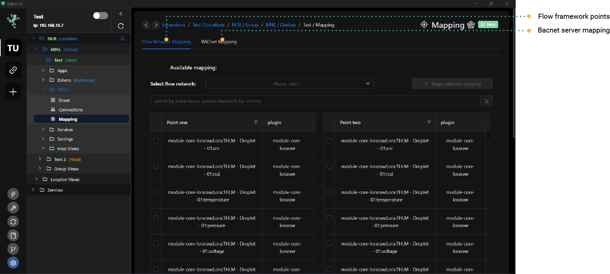

# Point Mapping

Mapping is used for convert one protocol to another via rubix-wires.

For example  
- map LoRa sensors to BACnet-Server so a 3rd party BMS system can add lora sensor to their BMS system
- map a LoRa sensor with `motion` to turn on/off a relay on a modbus-rtu device

:::info Important thing to note before proceeding:
* Install required **[apps](../setup/apps.md)** **rubix-edge-wires**
* Install required **[apps](../setup/apps.md)** **flow-framework**
* Install required **[apps](../setup/apps.md)** **driver-bacnet**  
:::

# Flow-Framework mapping

:::info
First open the **wires** tab and add/setup a **flow-network** node, and give it a name easy to remember
::: 

1. open the device you wish to work on
2. navigate to the **wires/mapping**
3. click on Flow network mapping tab
4. select the flow-network that was already added in rubix-wires
5. Select the point you want to map `From` in the Point-One Table
6. Select the point you want to map `To` in the Point-Two Table
7. Click on the **Stage Selected Mapping** Button, This will add the points in the `Staged mapping` table
8. Add as many mapping as you require
9. Once fished click on the  **Create/Delete Mapping** Button
10. Once this is done you will be sent to the rubix-wires flow editor you need to download the new mapping that was added

# BACnet-Server mapping

:::info
First open the **wires** tab and add/setup a **flow-network** node, and give it a name easy to remember  
First open the **wires** tab and add/setup a **bacnet-server** node, and give it a name easy to remember 
:::

1. open the device you wish to work on
2. navigate to the **wires/mapping**
3. click on BACnet mapping tab
4. select the flow-network that was already added in rubix-wires
5. Select the point you want to map
6. Click on the **Stage Selected Mapping** Button, This will add the points in the `Staged mapping` table
7. Add as many mapping as you require
8. Once fished click on the  **Create/Delete Mapping** Button
9. Once this is done you will be sent to the rubix-wires flow editor you need to download the new mapping that was added

