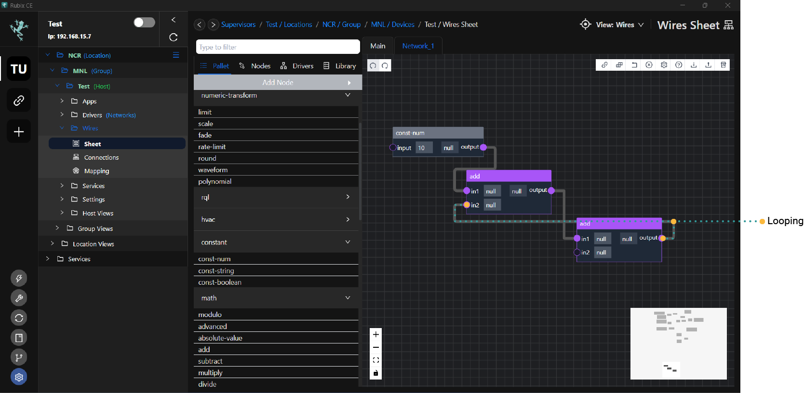
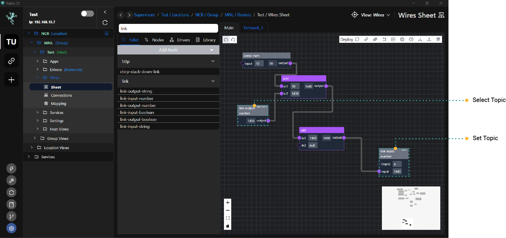

# Getting Started

# Overview

Wires is a programming tool that facilitates the integration, management, and automation of various devices, systems, and processes within a networked environment. It provides tools and capabilities for creating, configuring, and controlling workflows, data flows, and communication protocols between different components.

The term wires refers to the connections or pathways through which data, commands, or signals flow between different elements, such as sensors, actuators, controllers, and software applications. These connections can be established, configured, and managed within the Wires, enabling seamless interaction and interoperability between diverse technologies and systems.

Wires employs a concept called "Flows," which are a type of logical programming constructed by connecting nodes to create customised functionalities. These flows are dynamically built and modified during runtime, allowing for real-time adjustments. Additionally, flows can be exported and imported in JSON format, facilitating easy sharing and replication of custom functionalities across different instances or environments.

# What is a node

A node represents a block of logic or functionality within the system. There are various types of nodes, each representing different functions or operations that can be performed. These nodes can be connected by linking their inputs and outputs, allowing values to be passed between them. This interconnected network of nodes forms logical flows, enabling the creation of complex workflows and automation processes within the Wires. By connecting nodes together, users can build custom logic and implement specific functionalities tailored to their needs, leveraging the flexibility and versatility of the node-based architecture.

# About The Editor

The **Editor** within Wires serves as the interface for connecting nodes to construct your program. For instance, you can add three nodes: `two const-num nodes` and `one add node`. Then, you would connect the `output` of each `const-num node` to the `inputs in1 and in2` on the `add node`, respectively.

This arrangement forms what is known as a **Flow Program**, where nodes are interconnected to define the logic and functionality of the program. By linking nodes together in this manner, you can create customised workflows and implement specific tasks within the Wires environment.

# Flow Program

**Flow Program** is essentially a collection of nodes and their interconnected wired connections that collectively form a complete program. Each node represents a specific function or logic block, and the connections between nodes define how data flows and how operations are performed within the program. By organizing and configuring nodes in a meaningful way, users can create comprehensive programs tailored to their specific needs, leveraging the flexibility and versatility of Wires.

# Editor Overview

The **editor** serves as the workspace where you can both write and test your programs in Wires. Here, you can add, configure, and connect nodes to create your logic flows or programs. Additionally, you can simulate or run your programs within the editor environment to test their functionality and behavior. This allows for iterative development, debugging, and refinement of your programs until they meet your desired specifications and requirements. Essentially, the **editor** provides a user-friendly interface for the entire program development lifecycle within Wires.

# Editor Buttons

Editor buttons are used to do the following
* **Deploy** - any changes you have made to the configuration will be saved and applied, allowing the edited program or workflow to take effect
* **Settings** - Provides access to configuration options and settings related to the editor interface or program behavior.
* **Help** - Offers assistance and guidance in navigating and utilizing the editor effectively.
* **Import/Export** -  Enables importing or exporting configurations or setups of nodes and connections, allowing users to share or transfer their work between different instances or environments.
* **Wipe Flow** - Clears the current configuration or setup of nodes and connections from the editor, effectively resetting the workspace to its initial state. This can be useful for starting fresh or removing unwanted changes.

# Shortcuts

- Hold Control and left-click to select nodes or connections.
- Hold Control and press A to select all nodes.
- Hold Control and press E to export to nodes.
- Hold Control and press I to import to nodes.
- Hold Control and press C to copy nodes.
- Hold Control and press D to duplicate nodes.
- Hold Control and press Z to undo.
- Hold Control and press Y to redo.
- Hold Control and press X to cut.
- Hold Control and press S to save/deploy the flow.

These shortcuts provide quick access to commonly used functions, enhancing efficiency and productivity while working in the editor.

# Looping

:::danger Looping
In Wires, it's not permitted to create loops by connecting the output of a node back to nodes that are part of its own input or connected into itself. This restriction ensures that the program doesn't enter an infinite loop, which could potentially cause unintended behavior or system instability. By disallowing such loops, Wires promotes the creation of well-defined and manageable logic flows within the program.
:::

To rectify you can use the `link` nodes

