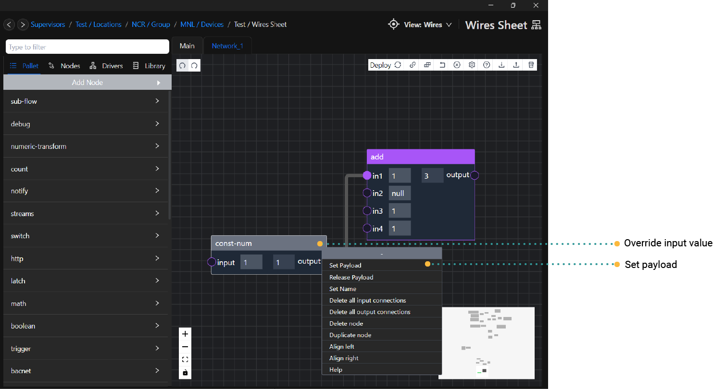

# Payload
The `Set Payload` function is utilized when users intend to send a value to the Wires runtime without necessitating a re-deploy of the flow.

Its primary purpose is evident during the commissioning of a program, particularly when adjustments such as setting a new setpoint are required.

:::caution
When transmitting a payload value to the Wires runtime, it's essential to note that this payload won't persist through device restarts or when a new program is re-deploy.
:::

## Supported nodes

- const-num
- const-bool
- const-string

:::tip
To remove the existing payload value, right-click on the node and select `Release Payload`. This action will revert the node to its `default input value`.
:::

