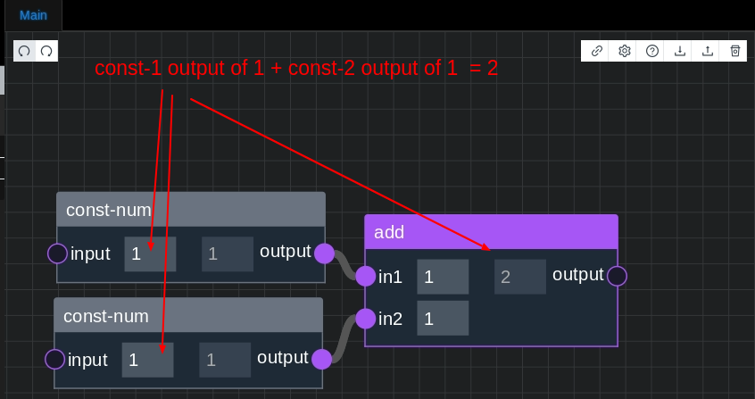
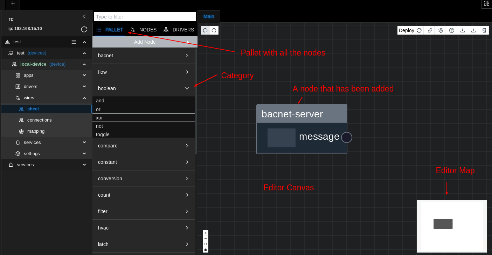
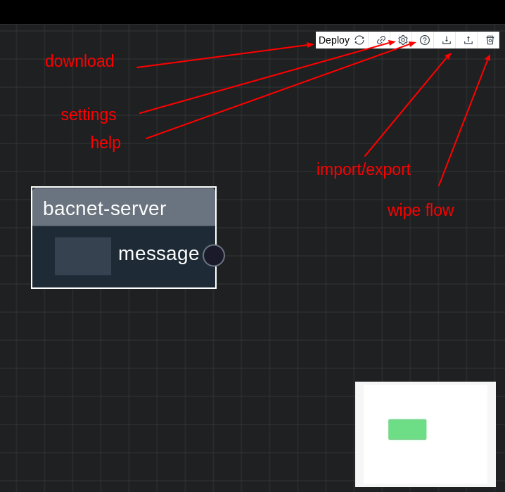

# Getting Started

# Overview

A Flow is a type of logical programming that is created by linking nodes together to create custom functionality. These
flows are build and modified in live runtime. Flows can be exported and imported as JSON.

# What is a node

A node is a block of logic in Wires. There are many nodes representing many functions. You can connect the inputs and
outputs of a node to other nodes to send values between nodes (thus creating logic flows).

# About The Editor

The Editor is used to connect nodes together to write your program

For example add 3x nodes 2x **const-num** and node **add** and wire each **const-num** output into input `in1` and `in2`
on the **add** node

What we have created is called a **Flow Program**

# Flow Program

A **Flow Program** is a collection of nodes and wired connections that will create complete program

# Editor Overview

The editor is where to write and test your programs

# Editor Buttons

The buttons are used to do the following

# Shortcuts

* Hold Control and Left click to select nodes or connections.
* Hold Control and A to select all node.
* Hold Control and E for export to nodes .
* Hold Control and I for import to nodes.
* Hold Control and C to copy nodes.
* Hold Control and D to duplicate nodes.
* Hold Control and Z to undo.
* Hold Control and Y to redo.
* Hold Control and X to cut.
* Hold Control and S to save/deploy flow.

